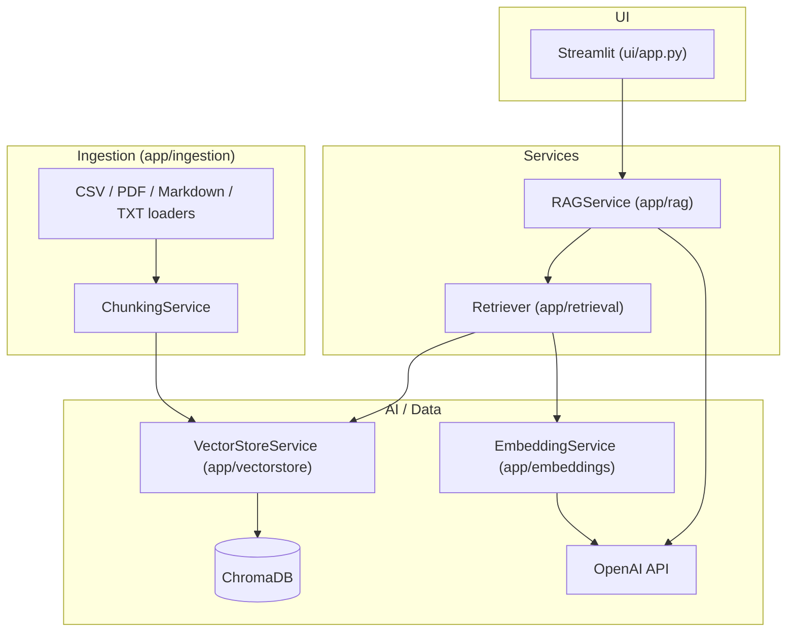
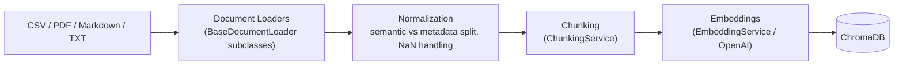
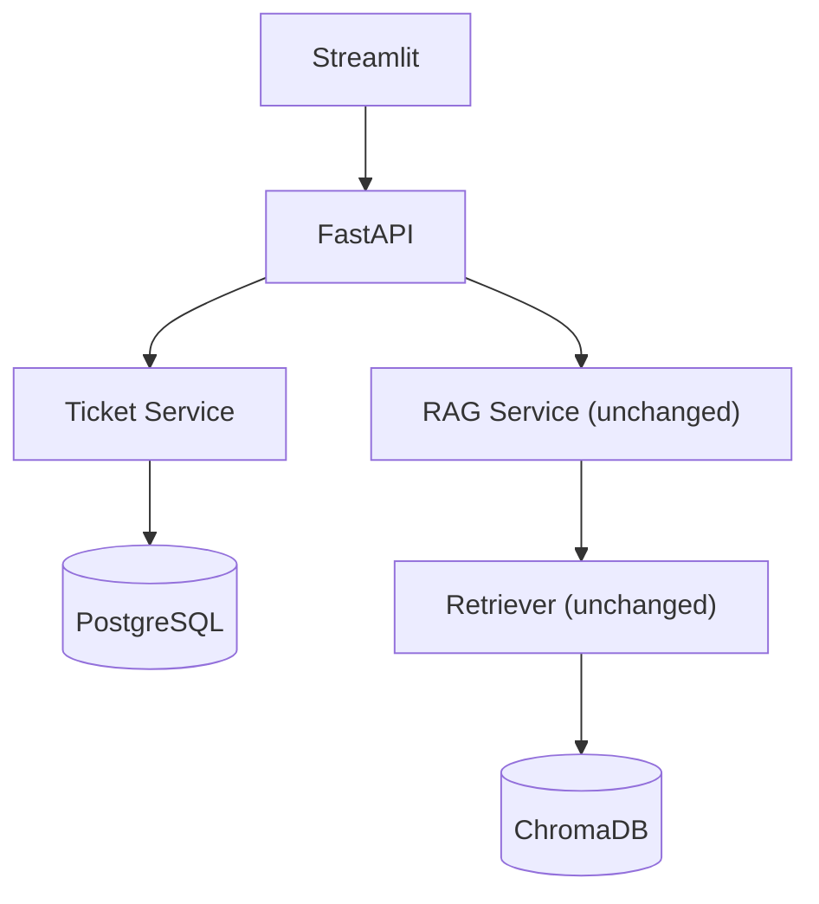
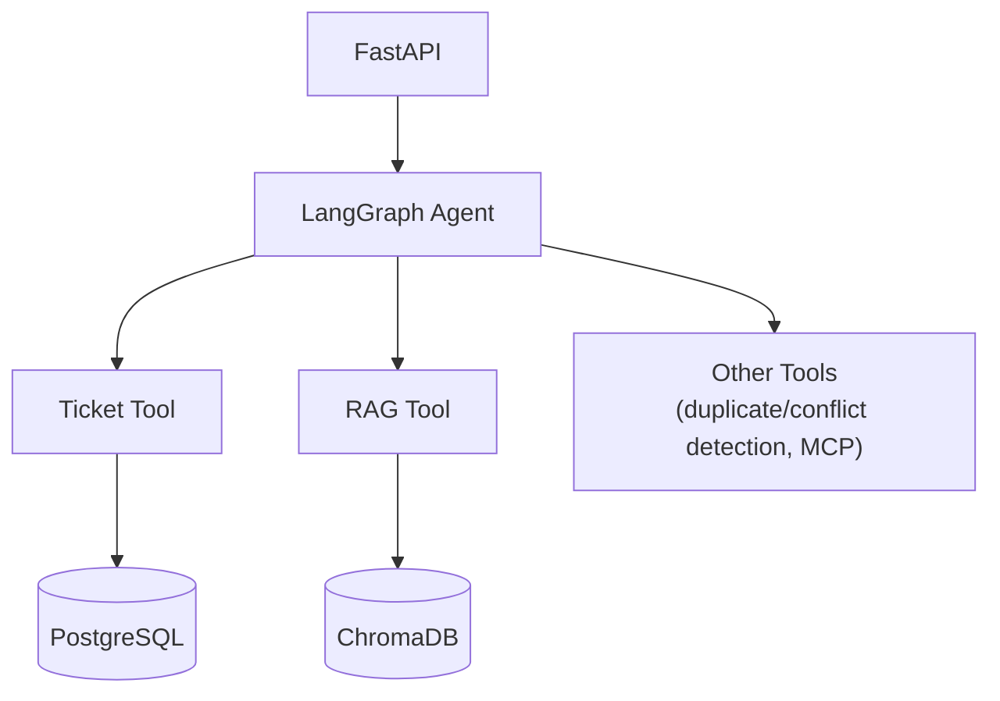

# AI Support Ticket Resolver

A RAG-powered assistant that searches historical support tickets and support documentation to suggest grounded resolutions, with sources, for new support problems.

> **Status:** Phase 1 implemented — RAG ingestion pipeline + Streamlit chatbot. See [Phase 2](#phase-2-not-implemented) for what's deliberately deferred.

## Quickstart

```bash
python3 -m venv .venv && source .venv/bin/activate && pip install -r requirements.txt
cp .env.example .env   # then put a real OPENAI_API_KEY in .env
python scripts/ingest.py --source data/sample/sample_tickets.csv
streamlit run ui/app.py
pytest
```

Requires Python 3.11+; see [Setup](#setup) if `pip install` fails building `tokenizers` on your system (e.g. on brand-new Python releases without prebuilt wheels yet).

## Table of Contents

- [Quickstart](#quickstart)
- [Overview](#overview)
- [Phase 1 Scope](#phase-1-scope)
- [Architecture](#architecture)
- [Data Ingestion Flow](#data-ingestion-flow)
- [Embedded Content vs. Metadata](#embedded-content-vs-metadata)
- [Project Structure](#project-structure)
- [Setup](#setup)
- [Ingesting Data](#ingesting-data)
- [Running Streamlit](#running-streamlit)
- [Running Tests](#running-tests)
- [Evaluation Framework](#evaluation-framework)
- [Adjusting for the Real Mesos CSV](#adjusting-for-the-real-mesos-csv)
- [Phase 2 (Not Implemented)](#phase-2-not-implemented)
- [Assumptions](#assumptions)

## Overview

Support engineers often re-investigate problems that were already solved in a past ticket or documented in a runbook — the fix exists, but finding it is slow, and a new ticket rarely uses the same wording as the old one. This project retrieves semantically similar historical tickets and documentation for a new support problem, then asks an LLM to produce a resolution **grounded in that retrieved evidence**, along with the sources it drew on.

## Phase 1 Scope

Phase 1 is the RAG foundation only, with a simple Streamlit chatbot as the UI:

```
Data Sources (CSV / PDF / Markdown / TXT)
    → Document Loaders
    → Normalization
    → Chunking
    → Embeddings
    → ChromaDB
    → Retriever
    → RAG Service
    → LLM
    → Grounded answer + sources
```

Deliberately **not** in Phase 1: FastAPI, a ticket database (PostgreSQL/SQLite), LangGraph, agents, MCP, duplicate/conflict detection. See [Phase 2](#phase-2-not-implemented).

## Architecture



Streamlit never talks to ChromaDB or OpenAI directly — it only calls `RAGService`:

```
GOOD:  Streamlit → RAGService → Retriever → VectorStoreService → ChromaDB
BAD:   Streamlit → (Chroma calls, OpenAI calls scattered throughout)
```

This boundary is what lets Streamlit be pointed at a FastAPI backend in Phase 2 without restructuring the RAG code — see [Phase 2](#phase-2-not-implemented).

## Data Ingestion Flow



Loader abstraction (`app/ingestion/base.py`):

```
BaseDocumentLoader
        │
        ├── TicketCSVLoader       (app/ingestion/csv_loader.py)
        ├── PDFDocumentLoader     (app/ingestion/pdf_loader.py)
        ├── MarkdownDocumentLoader(app/ingestion/markdown_loader.py)
        └── TextDocumentLoader    (app/ingestion/text_loader.py)
```

Every loader returns a list of `Document(page_content, metadata)`. Everything after loading (chunking, embedding, storage) is source-agnostic. `app/ingestion/pipeline.py` picks a loader by file extension and runs the full load → chunk → embed → persist sequence; `scripts/ingest.py` is its CLI.

Ingestion is **idempotent**: chunk IDs are derived deterministically from `ticket_id` (or `source_file`) + `chunk_index`, and writes use Chroma's `upsert`, so re-running ingestion on the same source updates existing vectors instead of duplicating them. Use `--reset` to fully clear a source's chunks first (e.g. after changing chunk size or column mapping).

## Embedded Content vs. Metadata

This separation is intentional and is enforced in `app/ingestion/csv_loader.py` and `app/ingestion/mapping.py`:

| Goes into embedded text (semantic) | Goes into Chroma metadata (structured) |
|---|---|
| summary | ticket_id |
| description | component |
| comments | status |
| resolution | issue_type |
| | created_date, resolved_date |

Example:

```json
{
  "id": "MESOS-1234::chunk::0",
  "document": "Title: Docker executor fails during startup\n\nProblem:\n...\n\nResolution:\n...",
  "metadata": {
    "ticket_id": "MESOS-1234",
    "component": "docker",
    "status": "Resolved",
    "issue_type": "Bug",
    "resolved_date": "2023-04-18",
    "source_type": "csv",
    "source_file": "sample_tickets.csv",
    "chunk_index": 0
  }
}
```

Metadata is never embedded — it exists purely for filtering, citations, and display. NaN/empty CSV values are dropped rather than becoming the literal text `"nan"` in either the document or the metadata.

## Project Structure

```
ai-support-ticket-resolver/
│
├── app/
│   ├── config/
│   │   └── settings.py          # env-driven Settings (OPENAI_API_KEY, models, chunk size, ...)
│   │
│   ├── ingestion/
│   │   ├── base.py              # BaseDocumentLoader, IngestionError, clean_text
│   │   ├── mapping.py           # CSVFieldMapping (configurable column names)
│   │   ├── csv_loader.py        # TicketCSVLoader
│   │   ├── pdf_loader.py        # PDFDocumentLoader
│   │   ├── markdown_loader.py   # MarkdownDocumentLoader
│   │   ├── text_loader.py       # TextDocumentLoader
│   │   ├── chunker.py           # ChunkingService
│   │   └── pipeline.py          # IngestionPipeline (loader -> chunk -> embed -> persist)
│   │
│   ├── embeddings/
│   │   └── service.py           # EmbeddingService (OpenAI embeddings)
│   │
│   ├── vectorstore/
│   │   └── chroma_store.py      # VectorStoreService (all Chroma calls live here)
│   │
│   ├── retrieval/
│   │   └── retriever.py         # Retriever (top-k + metadata filters)
│   │
│   ├── rag/
│   │   ├── prompts.py           # prompt templates, separate from logic
│   │   └── service.py           # RAGService.answer(question, filters)
│   │
│   └── models/
│       └── schemas.py           # Document, RetrievedChunk, RAGSource, RAGResult
│
├── ui/
│   ├── app.py                   # entrypoint: page config, logo/header, navigation
│   ├── branding.py              # product name, logo, header
│   ├── formatting.py            # response-metrics line (live + final)
│   ├── assets/icon.svg          # logo
│   └── views/
│       ├── chat.py              # chat page, calls RAGService only (chat-model picker, live metrics)
│       └── evals.py             # Evals page: run, metrics, label, align (calls evals/ only)
│
├── scripts/
│   └── ingest.py                # CLI: python scripts/ingest.py --source <file>
│
├── data/
│   └── sample/
│       └── sample_tickets.csv   # synthetic Mesos-style ticket dataset
│
├── evals/                       # evaluation framework (see "Evaluation Framework")
│   ├── datasets/queries.jsonl   # the test set (generated draft, then hand-edited)
│   ├── labels/                  # your human pass/fail labels (ground truth for the judges)
│   ├── judges/                  # binary LLM judges + their editable prompts
│   ├── generate_queries.py  run.py  judge_run.py  label.py  align.py  report.py  checks.py
│   └── results/                 # one JSONL of traces per run (gitignored)
│
├── tests/
│   ├── conftest.py              # fake embedding fixture, temp Chroma fixture
│   ├── test_csv_loader.py
│   ├── test_chunking.py
│   ├── test_retrieval.py
│   └── test_rag_service.py
│
├── chroma_db/                   # local persisted vector store (gitignored)
├── .env.example
├── .gitignore
├── requirements.txt
└── README.md
```

## Setup

Requires **Python 3.11+** (this repo was validated on 3.12 — the `tokenizers` wheel a transitive dependency pulls in does not yet publish a 3.14 build; if `pip install` fails building `tokenizers` on your system, use 3.11/3.12/3.13).

```bash
python3 -m venv .venv
source .venv/bin/activate          # .venv\Scripts\activate on Windows
pip install -r requirements.txt

cp .env.example .env
# then edit .env and set a real OPENAI_API_KEY
```

## Ingesting Data

```bash
python scripts/ingest.py --source data/sample/sample_tickets.csv
```

This works the same way for other source types once files exist:

```bash
python scripts/ingest.py --source docs/runbook.pdf
python scripts/ingest.py --source docs/troubleshooting.md
python scripts/ingest.py --source docs/faq.txt
```

Re-running ingestion on the same file is safe (upserts by deterministic ID). Pass `--reset` to clear that source's chunks first, e.g. after changing `CHUNK_SIZE`/`CHUNK_OVERLAP` or a CSV mapping:

```bash
python scripts/ingest.py --source data/sample/sample_tickets.csv --reset
```

## Running Streamlit

```bash
streamlit run ui/app.py
```

The app is called **Resolver Support**: a header with the logo on every page, and a sidebar with two pages, **Resolver** (the chatbot) and **Evals**. Brand accent colour lives in `.streamlit/config.toml`.

Ask a support question in the chat box; optionally set a `component`/`status` filter in the sidebar. Pick the chat model in the sidebar. The answer streams in as it is generated, with a live metrics line under it (model, elapsed time split into retrieval and generation, output tokens so far) that settles on the exact final numbers, including input tokens. Answers show the grounded resolution plus an expandable list of source tickets. Requires a real `OPENAI_API_KEY` in `.env` — the app loads without one but shows a warning and will error on your first question.

## Running Tests

```bash
pytest
```

Tests never call the real OpenAI API — `tests/conftest.py` provides a deterministic `FakeEmbeddingService`, and `RAGService`'s LLM client is mocked where prompt/response logic is tested. Coverage includes: CSV → Document conversion, semantic/metadata separation, NaN/malformed-row handling, configurable column mapping, chunk metadata preservation, vector store idempotency, metadata filtering, and RAG source deduplication / no-evidence fallback.

## Evaluation Framework

Instead of eyeballing answers, `evals/` measures the resolver on a test set: deterministic checks, binary LLM judges, latency/tokens, and a step that aligns the judges with *your* verdicts. All commands run from the repo root and need a real `OPENAI_API_KEY`; models are parameters (`--chat-model`, `--judge-model`, default `gpt-4o-mini` via `CHAT_MODEL` / `JUDGE_MODEL`).

```bash
python -m evals.generate_queries --n 30     # 1. draft a test set from real tickets, then EDIT it by hand
python -m evals.run                         # 2. answer every query; run checks + judges; print a report
python -m evals.label evals/results/<run>.jsonl   # 3. label pass/fail with a short reason (judge verdicts hidden)
python -m evals.align evals/results/<run>.jsonl   # 4. where do the judges disagree with you?
# edit evals/judges/prompts/<metric>.md, then re-judge the SAME traces (your labels stay valid) and re-align:
python -m evals.judge_run evals/results/<run>.jsonl
python -m evals.report evals/results/<run>.jsonl  # pass rates, latency p50/p95, tokens, failure reasons
```

**In the UI:** `streamlit run ui/app.py`, then open **Evals** in the sidebar. The tabs mirror the CLI steps: **Run** (edit the test set, pick the chat model and judge model, run), **Metrics** (pass-rate tiles, pass rate by query kind, latency/tokens, a trace inspector, and a "compare with" run selector that shows deltas), **Label** (blind pass/fail), and **Align** (judge vs your labels, plus an editor to tune a judge prompt and re-judge the run). Models offered in the pickers come from `AVAILABLE_MODELS` in `.env`.

What is measured:

| Layer | Metric | How |
|---|---|---|
| Retrieval | `retrieval_hit` (source ticket in top-k), `context_relevance` | code / LLM judge |
| Answer | `faithfulness`, `answer_relevancy` | LLM judge (binary 0/1 + one-line reason) |
| Behaviour | `citations_valid` (no invented ticket IDs), `abstention_correct`, `has_required_sections` | code |
| Performance | latency (total / retrieval / generation), tokens, tool calls (empty until an agent exists) | measured |

Notes: query kinds are `answerable`, `filtered` (asked with a metadata filter) and `unanswerable` (off-topic; the right behaviour is to abstain). Generated queries tend to echo their source ticket, so `retrieval_hit` on a generated set is optimistic until you reword some. `evals.run` executes queries one at a time so latency isn't skewed by concurrency; judging is parallel. `evals.generate_queries` refuses to overwrite an existing dataset without `--force`.

## Adjusting for the Real Mesos CSV

When the real dataset arrives, you should **not** need to touch ingestion code. Two options:

**1. Inline override**, e.g. in a small script or notebook:

```python
from app.ingestion.mapping import CSVFieldMapping

mapping = CSVFieldMapping().with_overrides(
    metadata_fields={"ticket_id": "key", "component": "components", "resolved_date": "resolved"},
)
```

**2. A JSON mapping file**, passed to the CLI:

```json
{
  "metadata_fields": {
    "ticket_id": "key",
    "component": "components",
    "resolved_date": "resolved"
  }
}
```

```bash
python scripts/ingest.py --source data/mesos_tickets_real.csv --csv-mapping config/mesos_mapping.json --reset
```

Only fields you override need to be listed; everything else falls back to the default mapping in `app/ingestion/mapping.py`. If the real CSV is missing a column mapped to a *required* logical field (`ticket_id`, `summary` by default), `TicketCSVLoader` raises a clear `IngestionError` naming the missing column rather than silently ingesting broken data.

## Phase 2 (Not Implemented)

Phase 1 intentionally stops at a working RAG chatbot. The service boundaries above exist so these can be added later without rewriting retrieval/RAG logic:



And further out:



Deliberately deferred:

- FastAPI application layer + `POST/GET/PUT /tickets` CRUD
- A ticket database (PostgreSQL)
- LangGraph orchestration / agent & tool calling
- Duplicate ticket detection
- Conflict / outdated-resolution detection
- MCP integrations

`RAGService.answer(question, filters)` is the intended seam: callable from Streamlit today, from a FastAPI route tomorrow, or wrapped as a LangGraph tool/node later.

## Assumptions

- The real Mesos CSV's exact column names, and whether all expected fields (comments, resolution, etc.) are actually present, are unknown — ingestion is built around a configurable mapping specifically because of this.
- A ticket's `summary` is duplicated into Chroma metadata (in addition to being embedded as part of the document text) purely so the UI/RAG sources can display a title without re-parsing `page_content`; it is not used for filtering.
- `chunk_size=1200` / `chunk_overlap=150` (`.env.example`) are reasonable starting defaults, not a tuned/evaluated strategy.
- Cosine similarity (via Chroma's `hnsw:space=cosine`) is used for the relevance score shown in retrieval results.
