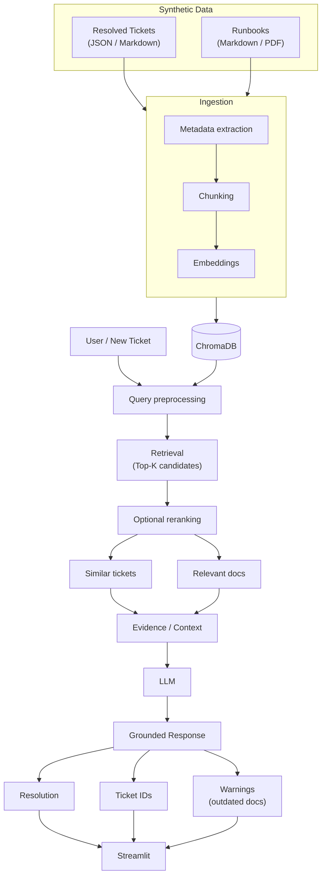
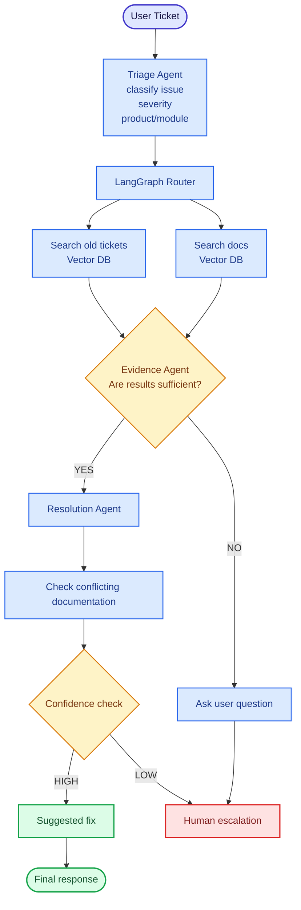

# AI Support Ticket Resolver

A RAG-powered assistant that helps support teams resolve tickets faster by grounding suggested resolutions in historical tickets and internal documentation, instead of starting each investigation from scratch.

> **Status:** 🚧 Early stage — this repo currently holds the architecture and implementation plan. Code is being built out milestone by milestone (see [Roadmap](#roadmap) below).

## Table of Contents

- [Overview](#overview)
- [Architecture](#architecture)
- [Tech Stack](#tech-stack)
- [Data Responsibilities](#data-responsibilities)
- [Roadmap](#roadmap)
- [Planned Architecture (Phase 2)](#planned-architecture-phase-2)
- [Success Criteria](#success-criteria)
- [Getting Started](#getting-started)
- [Contributing](#contributing)
- [License](#license)

## Overview

Support teams often spend significant time investigating issues that have already been resolved elsewhere — the fix exists somewhere in a past ticket or a runbook, but finding it is slow. The Support Ticket Resolver addresses this by retrieving relevant historical tickets and documentation for a new ticket, then using an LLM to produce a resolution grounded in that retrieved evidence, along with the sources it drew on.

## Architecture

The core (current) pipeline is a retrieval-augmented generation flow: historical tickets and runbooks are ingested into a vector store, and a new ticket is resolved by retrieving similar evidence and passing it to an LLM.



The system uses a frontend/backend split:

- **Frontend** — Streamlit application
- **Backend** — FastAPI REST API
- **Data layer** — SQLite (application state) and ChromaDB (semantic knowledge)
- **AI layer** — LangChain-based RAG pipeline

## Tech Stack

| Layer | Technology |
|---|---|
| Frontend | Streamlit |
| Backend API | FastAPI |
| Application state | SQLite + SQLAlchemy |
| Vector store | ChromaDB |
| RAG pipeline | LangChain |
| Data validation | Pydantic |
| Generation | LLM (RAG-grounded) |

## Data Responsibilities

**SQLite** manages application state: tickets, resolutions, status, priority, feedback, and metadata such as timestamps.

**ChromaDB** stores the semantic knowledge base: resolved historical tickets, support documentation, troubleshooting guides, runbooks, and FAQs, each with source-attribution metadata.

## Roadmap

Development proceeds through five milestones:

1. **Application Foundation** — Streamlit, FastAPI, and SQLite integration
2. **Knowledge Base** — document ingestion, chunking, and embeddings
3. **RAG Resolution** — retrieval pipeline and LLM integration
4. **Conflict Detection** — identifying potentially outdated or conflicting documentation
5. **Evaluation** — measuring system effectiveness

Advanced capabilities — LangGraph, autonomous agents, and MCP servers — are deliberately deferred until the core pipeline above proves reliable. That future direction is sketched out next.

## Planned Architecture (Phase 2)

Once the core RAG pipeline is solid, the plan is to evolve resolution into a multi-agent workflow: a triage step classifies the incoming ticket, a router directs retrieval, an evidence-sufficiency check decides whether to resolve automatically or ask a follow-up question, and a confidence check decides whether to hand off to a human.



This phase is **not yet implemented** — it's documented here to make the intended direction clear before building it.

## Success Criteria

The system should let users:

- create tickets
- request AI-suggested resolutions grounded in retrieved information
- view the supporting sources behind a suggestion
- receive warnings about conflicting or outdated documentation
- provide feedback on a resolution

## Getting Started

This project is still in the planning/early-build phase, so setup instructions will land here once the Application Foundation milestone is in place. In the meantime, the intended shape is:

```bash
git clone https://github.com/bee-honey/ai-support-ticket-resolver.git
cd ai-support-ticket-resolver
python -m venv .venv
source .venv/bin/activate  # or .venv\Scripts\activate on Windows
pip install -r requirements.txt
```

You'll also need API keys (e.g. an LLM provider key) available as environment variables — typically via a local `.env` file (not committed to git) loaded with `python-dotenv`.

## Contributing

This is currently a solo learning/build project. Issues and suggestions are welcome once the codebase is further along.

## License

TBD.