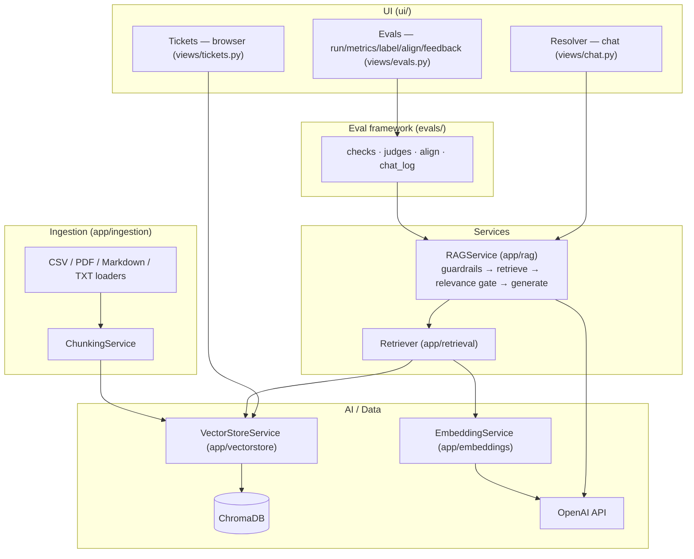
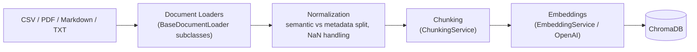
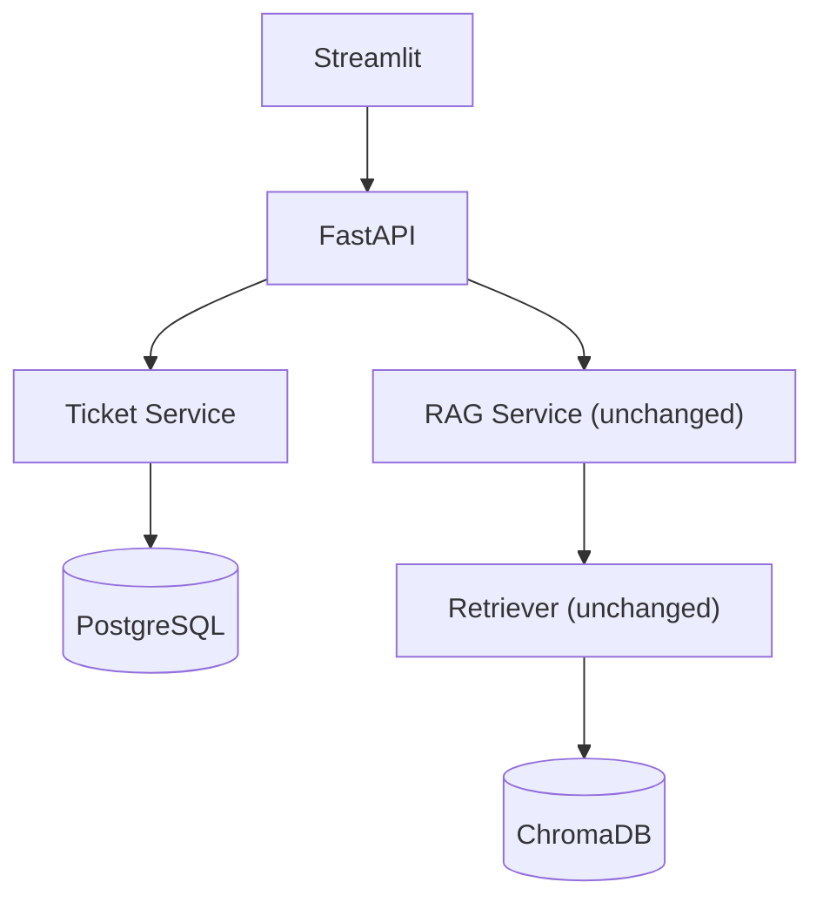
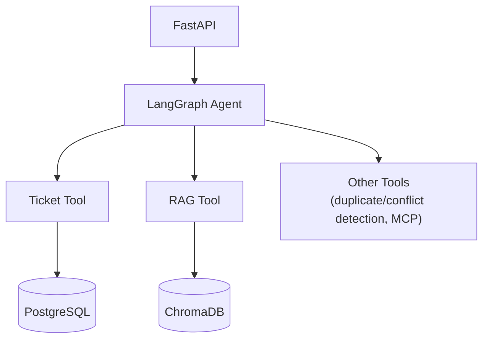

# AI Support Ticket Resolver

A RAG-powered assistant that searches historical support tickets and support documentation to suggest grounded resolutions, with sources, for new support problems.

> **Status:** RAG ingestion pipeline, a 3-page Streamlit app (Resolver chat, a Tickets browser, and Evals), input guardrails, and a full evaluation framework with a live self-improvement loop. See [Phase 2](#phase-2-not-implemented) for what's deliberately deferred.

## Capstone Submission

- **Live demo:** https://ai-support-ticket-resolver-98jrlkvnj7jjfqumtdzuus.streamlit.app
- **Demo video:** https://notebook.google.com/notebook/76da8c00-2761-4305-b66e-9ea2bae449f0/artifact/9a40e53a-72c5-48db-b3a7-b0da40bb476b
- **System design doc:** [docs/SYSTEM_DESIGN.md](docs/SYSTEM_DESIGN.md)
- **Instructor / grading guide:** [docs/INSTRUCTOR_GUIDE.md](docs/INSTRUCTOR_GUIDE.md) (also available as a [PDF](docs/INSTRUCTOR_GUIDE.pdf))

**Team:** Priyanka · Shubham Kumar · Mahaveer · Naveen Keerthy

## Quickstart

```bash
python3 -m venv .venv && source .venv/bin/activate && pip install -r requirements.txt
cp .env.example .env   # then put a real OPENAI_API_KEY in .env
python scripts/ingest.py --source data/sample/sample_tickets.csv   # small + fast; skip this and streamlit
                                                                    # run will auto-ingest the full real
                                                                    # corpus instead, which is slower/costs more
streamlit run ui/resolver_support.py
pytest
```

Requires Python 3.11+; see [Setup](#setup) if `pip install` fails building `tokenizers` on your system (e.g. on brand-new Python releases without prebuilt wheels yet).

## Table of Contents

- [Capstone Submission](#capstone-submission)
- [Quickstart](#quickstart)
- [Overview](#overview)
- [Phase 1 Scope](#phase-1-scope)
- [Architecture](#architecture)
- [Data Ingestion Flow](#data-ingestion-flow)
- [Embedded Content vs. Metadata](#embedded-content-vs-metadata)
- [Project Structure](#project-structure)
- [Setup](#setup)
- [Ingesting Data](#ingesting-data)
- [Running Streamlit](#running-streamlit)
- [Running Tests](#running-tests)
- [Evaluation Framework](#evaluation-framework)
- [Guardrails](#guardrails)
- [The Self-Improvement Loop](#the-self-improvement-loop)
- [Real-World CSV Mapping](#real-world-csv-mapping)
- [Phase 2 (Not Implemented)](#phase-2-not-implemented)
- [Assumptions](#assumptions)

## Overview

Support engineers often re-investigate problems that were already solved in a past ticket or documented in a runbook — the fix exists, but finding it is slow, and a new ticket rarely uses the same wording as the old one. This project retrieves semantically similar historical tickets and documentation for a new support problem, then asks an LLM to produce a resolution **grounded in that retrieved evidence**, along with the sources it drew on.

## Phase 1 Scope

Ingestion turns raw tickets/docs into searchable evidence:

```
Data Sources (CSV / PDF / Markdown / TXT)
    → Document Loaders
    → Normalization
    → Chunking
    → Embeddings
    → ChromaDB
```

Answering a question runs it through the reasoning pipeline (`RAGService.answer`, `app/rag/service.py`):

```
Question
    → Guardrails (PII redaction, prompt-injection check)
    → Retrieval (original question + one LLM-rewritten variant, merged)
    → Relevance gate (is the retrieved evidence actually on-topic?)
    → LLM generation, grounded only in the retrieved evidence
    → Grounded answer + sources
```

The Streamlit app (`ui/resolver_support.py`) has three pages: **Resolver** (the chat above, with live streaming metrics and 👍/👎 feedback), **Tickets** (a browsable, searchable view of every ingested ticket, cross-linked from chat citations so a citation never has to be trusted blind), and **Evals** (the evaluation framework — see below).

Deliberately **not** built: FastAPI, a ticket database (PostgreSQL/SQLite), LangGraph, agents, MCP, duplicate/conflict detection. See [Phase 2](#phase-2-not-implemented).

## Architecture

> For the full design write-up (goals/non-goals, design decisions and rejected alternatives, data design, non-functional characteristics), see [docs/SYSTEM_DESIGN.md](docs/SYSTEM_DESIGN.md).


```mermaid
flowchart TD
    subgraph UI_Layer["UI (ui/)"]
        ST["Resolver — chat (views/chat.py)"]
        TK["Tickets — browser (views/tickets.py)"]
        EV["Evals — run/metrics/label/align/feedback (views/evals.py)"]
    end
    subgraph Service_Layer["Services"]
        RAGSvc["RAGService (app/rag)<br/>guardrails → retrieve → relevance gate → generate"]
        RetrieverSvc["Retriever (app/retrieval)"]
    end
    subgraph AI_Layer["AI / Data"]
        EmbSvc["EmbeddingService (app/embeddings)"]
        VSSvc["VectorStoreService (app/vectorstore)"]
        Chroma[("ChromaDB")]
        OpenAI["OpenAI API"]
    end
    subgraph Ingestion_Layer["Ingestion (app/ingestion)"]
        Loaders["CSV / PDF / Markdown / TXT loaders"]
        Chunker["ChunkingService"]
    end
    subgraph Eval_Layer["Eval framework (evals/)"]
        EvalsPkg["checks · judges · align · chat_log"]
    end

    ST --> RAGSvc
    TK --> VSSvc
    EV --> EvalsPkg
    EvalsPkg --> RAGSvc
    RAGSvc --> OpenAI
    RAGSvc --> RetrieverSvc
    RetrieverSvc --> VSSvc
    RetrieverSvc --> EmbSvc
    EmbSvc --> OpenAI
    VSSvc --> Chroma
    Loaders --> Chunker --> VSSvc
```

The UI never talks to ChromaDB or OpenAI directly — each page only calls its one service boundary (`RAGService` for chat, `VectorStoreService` for the ticket browser, `evals/` for the Evals page):

```
GOOD:  Streamlit → RAGService → Retriever → VectorStoreService → ChromaDB
BAD:   Streamlit → (Chroma calls, OpenAI calls scattered throughout)
```

This boundary is what lets Streamlit be pointed at a FastAPI backend in Phase 2 without restructuring the RAG code — see [Phase 2](#phase-2-not-implemented).

## Data Ingestion Flow


```mermaid
flowchart LR
    SRC["CSV / PDF / Markdown / TXT"] --> LOAD["Document Loaders<br/>(BaseDocumentLoader subclasses)"]
    LOAD --> NORM["Normalization<br/>semantic vs metadata split, NaN handling"]
    NORM --> CHUNK["Chunking<br/>(ChunkingService)"]
    CHUNK --> EMB["Embeddings<br/>(EmbeddingService / OpenAI)"]
    EMB --> STORE[("ChromaDB")]
```

Loader abstraction (`app/ingestion/base.py`):

```
BaseDocumentLoader
        │
        ├── TicketCSVLoader       (app/ingestion/csv_loader.py)
        ├── PDFDocumentLoader     (app/ingestion/pdf_loader.py)
        ├── MarkdownDocumentLoader(app/ingestion/markdown_loader.py)
        └── TextDocumentLoader    (app/ingestion/text_loader.py)
```

Every loader returns a list of `Document(page_content, metadata)`. Everything after loading (chunking, embedding, storage) is source-agnostic. `app/ingestion/pipeline.py` picks a loader by file extension and runs the full load → chunk → embed → persist sequence; `scripts/ingest.py` is its CLI.

Ingestion is **idempotent**: chunk IDs are derived deterministically from `ticket_id` (or `source_file`) + `chunk_index`, and writes use Chroma's `upsert`, so re-running ingestion on the same source updates existing vectors instead of duplicating them. Use `--reset` to fully clear a source's chunks first (e.g. after changing chunk size or column mapping).

## Embedded Content vs. Metadata

This separation is intentional and is enforced in `app/ingestion/csv_loader.py` and `app/ingestion/mapping.py`:

| Goes into embedded text (semantic) | Goes into Chroma metadata (structured) |
|---|---|
| summary | ticket_id |
| description | component |
| comments | status |
| resolution | issue_type |
| | created_date, resolved_date |

Example:

```json
{
  "id": "MESOS-1234::chunk::0",
  "document": "Title: Docker executor fails during startup\n\nProblem:\n...\n\nResolution:\n...",
  "metadata": {
    "ticket_id": "MESOS-1234",
    "component": "docker",
    "status": "Resolved",
    "issue_type": "Bug",
    "resolved_date": "2023-04-18",
    "source_type": "csv",
    "source_file": "sample_tickets.csv",
    "chunk_index": 0
  }
}
```

Metadata is never embedded — it exists purely for filtering, citations, and display. NaN/empty CSV values are dropped rather than becoming the literal text `"nan"` in either the document or the metadata.

## Project Structure

```
ai-support-ticket-resolver/
│
├── app/
│   ├── config/
│   │   └── settings.py            # env-driven Settings (OPENAI_API_KEY, models, chunk size, ...)
│   │
│   ├── ingestion/
│   │   ├── base.py                # BaseDocumentLoader, IngestionError, clean_text
│   │   ├── mapping.py             # CSVFieldMapping (configurable column names)
│   │   ├── csv_loader.py          # TicketCSVLoader
│   │   ├── pdf_loader.py          # PDFDocumentLoader
│   │   ├── markdown_loader.py     # MarkdownDocumentLoader
│   │   ├── text_loader.py         # TextDocumentLoader
│   │   ├── chunker.py             # ChunkingService
│   │   ├── pipeline.py            # IngestionPipeline (loader -> chunk -> embed -> persist)
│   │   ├── bootstrap.py           # auto-ingest the checked-in dataset if Chroma is empty
│   │   └── ticket_lookup.py       # reads a ticket's full text back from its source CSV (Tickets page)
│   │
│   ├── embeddings/
│   │   └── service.py             # EmbeddingService (OpenAI embeddings)
│   │
│   ├── vectorstore/
│   │   └── chroma_store.py        # VectorStoreService (all Chroma calls live here)
│   │
│   ├── retrieval/
│   │   └── retriever.py           # Retriever (top-k + metadata filters)
│   │
│   ├── rag/
│   │   ├── prompts.py             # prompt templates, separate from logic
│   │   ├── guardrails.py          # redact_pii() -- deterministic, no LLM call
│   │   └── service.py             # RAGService: guardrails -> retrieve -> relevance gate -> generate
│   │
│   └── models/
│       └── schemas.py             # Document, RetrievedChunk, RAGSource, RAGResult
│
├── ui/
│   ├── resolver_support.py        # entrypoint: page config, logo/header, one-time data bootstrap, navigation
│   ├── branding.py                # product name, logo, header
│   ├── formatting.py              # response-metrics line (live + final)
│   ├── ticket_links.py            # ticket_page_link() -- shared deep-link used by chat/evals/tickets
│   ├── assets/icon.svg            # logo
│   └── views/
│       ├── chat.py                # Resolver: chat, calls RAGService only (model picker, live metrics, feedback)
│       ├── tickets.py             # Tickets: browse/search the ingested corpus, calls VectorStoreService only
│       └── evals.py               # Evals: run, metrics, label, align, feedback (calls evals/ only)
│
├── scripts/
│   └── ingest.py                  # CLI: python scripts/ingest.py --source <file>
│
├── data/
│   ├── mesos_scoped.csv           # the real, scoped Mesos ticket dataset (default source, see below)
│   └── sample/
│       └── sample_tickets.csv     # small synthetic dataset for a quick local smoke test
│
├── config/
│   └── mesos_mapping.json         # CSVFieldMapping overrides for data/mesos_scoped.csv
│
├── evals/                         # evaluation framework (see "Evaluation Framework")
│   ├── schemas.py                 # EvalQuery, Trace, HumanLabel + JSONL read/write helpers
│   ├── checks.py                  # deterministic (code-only) checks
│   ├── judges/                    # binary LLM judges + their editable prompts
│   ├── chat_log.py                # logs every live Resolver chat answer as a Trace
│   ├── generate_queries.py  run.py  judge_run.py  label.py  align.py  report.py
│   ├── datasets/                  # test sets (hand-edited, committed to git)
│   ├── labels/human_labels.jsonl  # SME pass/fail ground truth (committed to git)
│   ├── labels/chat_feedback.jsonl # real users' 👍/👎 on live chat answers (gitignored)
│   ├── chat_logs/                 # every live chat Q&A, logged automatically (gitignored)
│   └── results/                   # one JSONL of traces per eval run (gitignored)
│
├── docs/
│   ├── EVALS_GUIDE.md             # full eval framework walkthrough, worked examples, FAQ
│   ├── SELF_IMPROVEMENT_LOOP.md   # measure->build->measure case studies with real numbers
│   ├── AGENTIC_PHASE2_GUIDE.md    # roadmap for evolving into an agentic system
│   └── IMPLEMENTATION_GUIDE.md
│
├── tests/                         # one test file per app/ui/evals module (ingestion, chunking, retrieval,
│                                  # RAG service incl. guardrails/relevance gate/query rewriting, eval
│                                  # framework CLI + UI, chat/tickets UI incl. feedback)
│
├── chroma_db/                     # local persisted vector store (gitignored)
├── .python-version                # pinned for Streamlit Community Cloud (see Setup)
├── .env.example
├── .gitignore
├── requirements.txt
└── README.md
```

## Setup

Requires **Python 3.11+** (`.python-version` pins 3.12, which is what this repo is validated on and what tooling that respects that file — `pyenv`, Streamlit Community Cloud — will use automatically; the `tokenizers` wheel a transitive dependency pulls in does not yet publish a 3.14 build, so if `pip install` fails building `tokenizers` on your system, use 3.11/3.12/3.13).

```bash
python3 -m venv .venv
source .venv/bin/activate          # .venv\Scripts\activate on Windows
pip install -r requirements.txt

cp .env.example .env
# then edit .env and set a real OPENAI_API_KEY
```

## Ingesting Data

The app ingests its default dataset automatically the first time it runs against an empty vector store — see `app/ingestion/bootstrap.py` and [Running Streamlit](#running-streamlit) below. Manual ingestion is for everything else: a different source, a `--reset`, or the small sample dataset for a quick local smoke test without the full real corpus:

```bash
python scripts/ingest.py --source data/sample/sample_tickets.csv
python scripts/ingest.py --source data/mesos_scoped.csv --csv-mapping config/mesos_mapping.json
```

This works the same way for other source types once files exist:

```bash
python scripts/ingest.py --source docs/runbook.pdf
python scripts/ingest.py --source docs/troubleshooting.md
python scripts/ingest.py --source docs/faq.txt
```

Re-running ingestion on the same file is safe (upserts by deterministic ID). Pass `--reset` to clear that source's chunks first, e.g. after changing `CHUNK_SIZE`/`CHUNK_OVERLAP` or a CSV mapping:

```bash
python scripts/ingest.py --source data/sample/sample_tickets.csv --reset
```

## Running Streamlit

```bash
streamlit run ui/resolver_support.py
```

The app is called **Resolver Support**: a header with the logo on every page, and a sidebar with three pages — **Resolver**, **Tickets**, and **Evals**. Brand accent colour lives in `.streamlit/config.toml`. On first run against an empty vector store, it auto-ingests the checked-in dataset (a one-time spinner, then it's cached) so there's nothing to set up by hand before asking a question.

**Resolver** — ask a support question in the chat box; optionally set a `component`/`status` filter in the sidebar, and pick the chat model. The answer streams in as it's generated, with a live metrics line under it (model, elapsed time split into retrieval and generation, output tokens so far) that settles on the exact final numbers, including input tokens. Answers show the grounded resolution plus an expandable list of source tickets (each one a link into the Tickets page), and a 👍/👎 widget to rate the answer — see [Guardrails](#guardrails) and [The Self-Improvement Loop](#the-self-improvement-loop) for what runs before and after generation. Requires a real `OPENAI_API_KEY` in `.env` — the app loads without one but shows a warning and will error on your first question.

**Tickets** — browse and search every ingested ticket directly (read-only), with the same detail a citation points to. Reachable from the sidebar, or by clicking any ticket ID cited in a chat answer or shown in an Evals trace.

**Evals** — the evaluation framework's UI; see [Evaluation Framework](#evaluation-framework) below.

## Running Tests

```bash
pytest
```

Tests never call the real OpenAI API — `tests/conftest.py` provides a deterministic `FakeEmbeddingService`, LLM clients are mocked wherever prompt/response logic is tested, and UI pages are driven headlessly with Streamlit's `AppTest` against fake services. Coverage includes: CSV → Document conversion, semantic/metadata separation, NaN/malformed-row handling, configurable column mapping, chunk metadata preservation, vector store idempotency, metadata filtering; the RAG pipeline's guardrails, relevance gate, and query rewriting, plus source deduplication / no-evidence fallback; the eval framework's checks, judges, alignment, and CLI/UI; and the Resolver/Tickets/Evals pages themselves, including chat feedback capture.

## Evaluation Framework

> For the full walkthrough (what each screen does, worked examples, known findings, FAQ), see [docs/EVALS_GUIDE.md](docs/EVALS_GUIDE.md). This section is the quick-start.

Instead of eyeballing answers, `evals/` measures the resolver on a test set: deterministic checks, binary LLM judges, latency/tokens, and a step that aligns the judges with *your* verdicts. All commands run from the repo root and need a real `OPENAI_API_KEY`; models are parameters (`--chat-model`, `--judge-model`, default `gpt-4o-mini` via `CHAT_MODEL` / `JUDGE_MODEL`).

```bash
python -m evals.generate_queries --n 30     # 1. draft a test set from real tickets, then EDIT it by hand
python -m evals.run                         # 2. answer every query; run checks + judges; print a report
python -m evals.label evals/results/<run>.jsonl   # 3. label pass/fail with a short reason (judge verdicts hidden)
python -m evals.align evals/results/<run>.jsonl   # 4. where do the judges disagree with you?
# edit evals/judges/prompts/<metric>.md, then re-judge the SAME traces (your labels stay valid) and re-align:
python -m evals.judge_run evals/results/<run>.jsonl
python -m evals.report evals/results/<run>.jsonl  # pass rates, latency p50/p95, tokens, failure reasons
```

**In the UI:** `streamlit run ui/resolver_support.py`, then open **Evals** in the sidebar. Five tabs: **Run** (edit the test set, pick the chat model and judge model, run) and **Metrics** (pass-rate tiles, pass rate by query kind, latency/tokens, a trace inspector, and a "compare with" run selector that shows deltas) mirror the CLI steps above; **Label** (blind pass/fail) and **Align** (judge vs your labels, plus an editor to tune a judge prompt and re-judge the run) are the same. **Feedback** is different — real production data, not a test-set run: every live Resolver chat answer and its 👍/👎 rating shows up there, sorted worst-first, independent of any run selection (see [The Self-Improvement Loop](#the-self-improvement-loop)). Models offered in the pickers come from `AVAILABLE_MODELS` in `.env`.

What is measured:

| Layer | Metric | How |
|---|---|---|
| Retrieval | `retrieval_hit` (source ticket in top-k), `context_relevance` | code / LLM judge |
| Answer | `faithfulness`, `answer_relevancy` | LLM judge (binary 0/1 + one-line reason) |
| Behaviour | `citations_valid` (no invented ticket IDs), `abstention_correct`, `has_required_sections` | code |
| Performance | latency (total / retrieval / generation), tokens, tool calls (empty until an agent exists) | measured |

Notes: query kinds are `answerable`, `filtered` (asked with a metadata filter) and `unanswerable` (off-topic; the right behaviour is to abstain). Generated queries tend to echo their source ticket, so `retrieval_hit` on a generated set is optimistic until you reword some. `evals.run` executes queries one at a time so latency isn't skewed by concurrency; judging is parallel. `evals.generate_queries` refuses to overwrite an existing dataset without `--force`.

## Guardrails

Two input guardrails run before retrieval on every question (`app/rag/guardrails.py`, `RAGService._is_prompt_injection`):

- **Prompt-injection detection** — a cheap, separate LLM call (same design as the relevance gate) blocks attempts to override instructions, extract the system prompt, or make the assistant act outside its support-assistant role. Fails open on error, same as every other gate in this pipeline.
- **PII redaction** — deterministic regex (email/phone/credit-card shapes) applied to the question before it's embedded, sent to any LLM, or logged. Deliberately does **not** touch IP addresses, since real Mesos tickets legitimately contain them.

Deliberately scoped, not a full copy of a textbook guardrail taxonomy — see [SELF_IMPROVEMENT_LOOP.md § Case Study 3](docs/SELF_IMPROVEMENT_LOOP.md#case-study-3-guardrails--feedback) for what was left out and why, and a real, documented gap (the historical ticket corpus itself still contains real PII that a cited chunk can surface — input redaction doesn't fix that).

## The Self-Improvement Loop

> Full write-up with real before/after numbers from actual eval runs: [docs/SELF_IMPROVEMENT_LOOP.md](docs/SELF_IMPROVEMENT_LOOP.md).

Every non-trivial change to this project (the relevance gate, query rewriting, the guardrails above) followed the same discipline: measure a real problem on the eval set, build a fix, measure again on the same set, and treat an unexpected result as something to investigate rather than rationalize. Live usage feeds the same loop: every chat answer is logged (`evals/chat_logs/log.jsonl`) and every 👍/👎 given in the chat UI is captured as a `HumanLabel` (`evals/labels/chat_feedback.jsonl`) — kept separate from the curated SME labels used for judge alignment, but surfaced in its own **💬 Feedback** tab, sorted worst-first, so a real recurring complaint has a clear path into becoming a new eval-set case.

## Real-World CSV Mapping

`data/mesos_scoped.csv` (the real, scoped Mesos ticket dataset) doesn't use this project's default column names, so it's ingested via a JSON mapping file rather than any change to ingestion code — this is what `config/mesos_mapping.json` does:

```json
{
  "semantic_fields": {
    "comments": "all_comments"
  },
  "metadata_fields": {
    "ticket_id": "key",
    "component": "components",
    "created_date": "created"
  }
}
```

```bash
python scripts/ingest.py --source data/mesos_scoped.csv --csv-mapping config/mesos_mapping.json
```

Only fields that differ from the default need to be listed — `resolved_date`, for instance, is already named that in this CSV, so it isn't in the override and falls back to the default mapping in `app/ingestion/mapping.py`. The same mechanism works for any other CSV whose column names don't match the defaults — either as a JSON file (above, passed via `--csv-mapping`) or inline, e.g. in a small script or notebook:

```python
from app.ingestion.mapping import CSVFieldMapping

mapping = CSVFieldMapping().with_overrides(
    metadata_fields={"ticket_id": "key", "component": "components"},
)
```

If a source CSV is missing a column mapped to a *required* logical field (`ticket_id`, `summary` by default), `TicketCSVLoader` raises a clear `IngestionError` naming the missing column rather than silently ingesting broken data.

## Phase 2 (Not Implemented)

This project intentionally stops at a working RAG chatbot with guardrails and a full evaluation framework — it doesn't take actions, orchestrate tools, or persist anything beyond a local vector store and a few JSONL files. The service boundaries above exist so the items below can be added later without rewriting retrieval/RAG logic:


```mermaid
flowchart TD
    ST["Streamlit"] --> API["FastAPI"]
    API --> TSvc["Ticket Service"]
    API --> RAGSvc["RAG Service (unchanged)"]
    TSvc --> PG[("PostgreSQL")]
    RAGSvc --> Retr["Retriever (unchanged)"]
    Retr --> Chroma[("ChromaDB")]
```

And further out:


```mermaid
flowchart TD
    API2["FastAPI"] --> LG["LangGraph Agent"]
    LG --> TT["Ticket Tool"]
    LG --> RT["RAG Tool"]
    LG --> OT["Other Tools<br/>(duplicate/conflict detection, MCP)"]
    TT --> PG2[("PostgreSQL")]
    RT --> Chroma2[("ChromaDB")]
```

Deliberately deferred:

- FastAPI application layer + `POST/GET/PUT /tickets` CRUD
- A ticket database (PostgreSQL)
- LangGraph orchestration / agent & tool calling
- Duplicate ticket detection
- Conflict / outdated-resolution detection
- MCP integrations
- Production-grade tracing — today's chat logging (`evals/chat_logs/`) is a local, gitignored JSONL file with no span IDs and no cross-service correlation; it doesn't survive a redeploy on an ephemeral host. A real production version would ship traces to a persistent store instead.
- Corpus-wide PII redaction — the input guardrail (see [Guardrails](#guardrails)) only redacts the incoming question; a historical ticket already containing real PII can still surface it in a cited chunk.

`RAGService.answer(question, filters)` is the intended seam: callable from Streamlit today, from a FastAPI route tomorrow, or wrapped as a LangGraph tool/node later. See [docs/AGENTIC_PHASE2_GUIDE.md](docs/AGENTIC_PHASE2_GUIDE.md) for the fuller roadmap and [docs/SELF_IMPROVEMENT_LOOP.md § What's Still Human-in-the-Loop](docs/SELF_IMPROVEMENT_LOOP.md#whats-still-human-in-the-loop) for what's deliberately still a manual step in the eval/feedback loop itself.

## Assumptions

- A ticket's `summary` is duplicated into Chroma metadata (in addition to being embedded as part of the document text) purely so the UI/RAG sources can display a title without re-parsing `page_content`; it is not used for filtering.
- `chunk_size=1200` / `chunk_overlap=150` (`.env.example`) are reasonable starting defaults, not a tuned/evaluated strategy.
- Cosine similarity (via Chroma's `hnsw:space=cosine`) is used for the relevance score shown in retrieval results.
- The PII guardrail's regexes assume US-formatted phone numbers and card-shaped numbers, and deliberately never match IP addresses (real tickets legitimately contain them) — see `app/rag/guardrails.py`. It is not a general-purpose PII detector.
