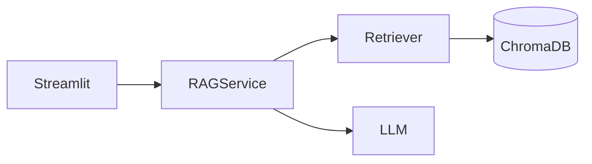
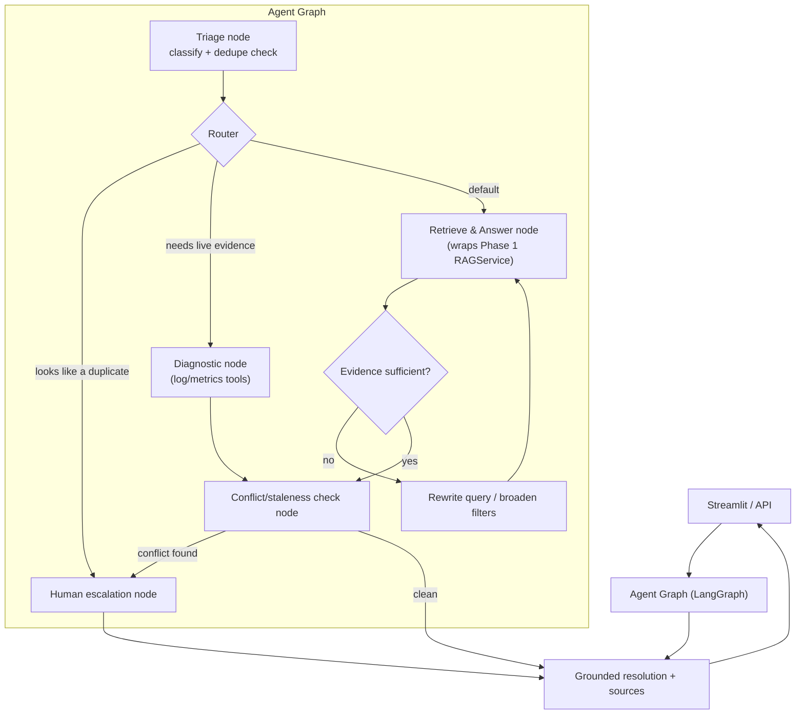
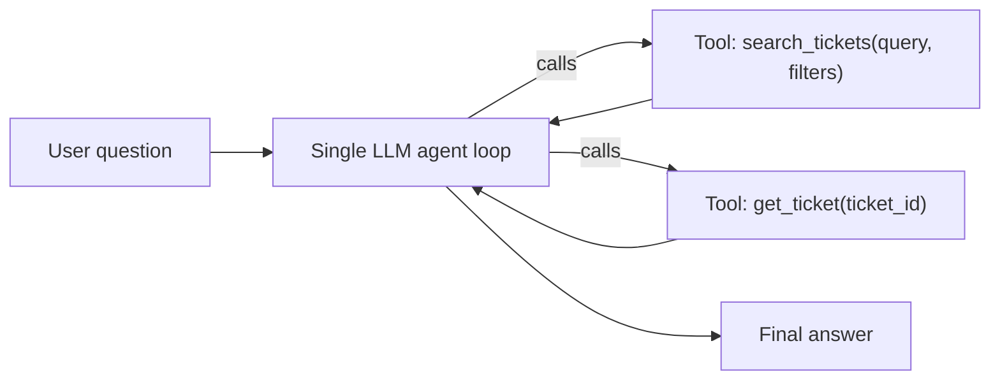
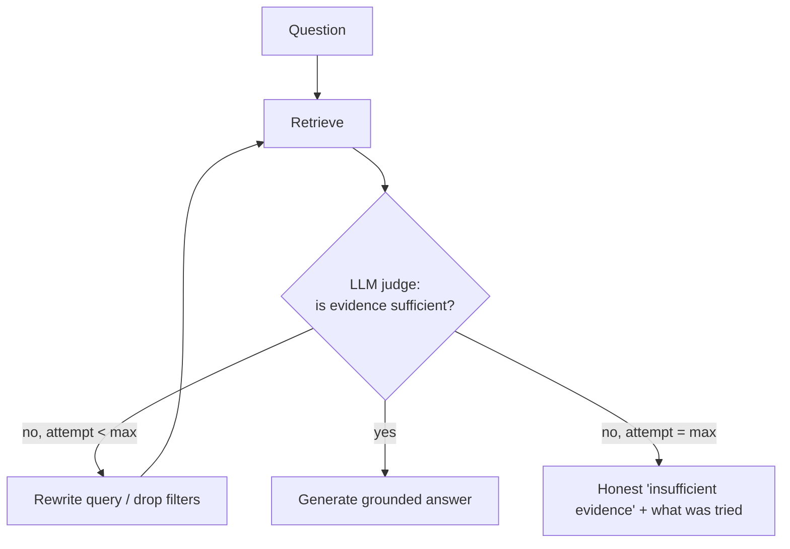
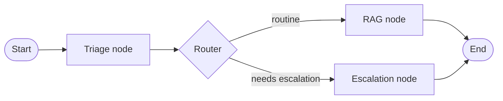
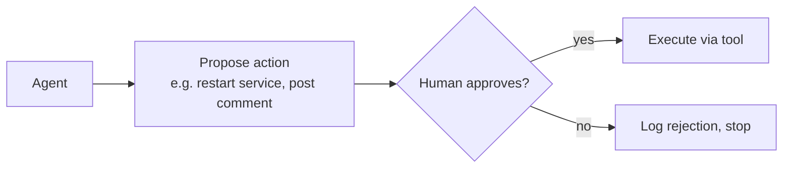

# Phase 2: Evolving Into an Agentic System

This is a learning-oriented implementation guide for turning the Phase 1 RAG chatbot into an agentic system. It assumes you've read [IMPLEMENTATION_GUIDE.md](IMPLEMENTATION_GUIDE.md) (Phase 1 architecture) and the root [README.md](../README.md).

Two goals, deliberately both in scope:

1. **Make the resolver more useful** in scenarios a single-shot RAG call genuinely can't handle.
2. **Teach the core AI engineering concepts** behind agentic systems, in a sequence where each concept is motivated by a real limitation you'll hit, not introduced for its own sake.

Nothing in this document is implemented yet. It's a roadmap, not code.

---

## Table of Contents

- [Why Not Just Bigger Prompts?](#why-not-just-bigger-prompts)
- [Where Agentic Behavior Actually Pays Off](#where-agentic-behavior-actually-pays-off)
- [Concepts You'll Learn, Mapped to Milestones](#concepts-youll-learn-mapped-to-milestones)
- [Target Architecture](#target-architecture)
- [Milestone Roadmap](#milestone-roadmap)
- [New Project Structure](#new-project-structure)
- [Tech Additions](#tech-additions)
- [Guardrails: What NOT to Automate Yet](#guardrails-what-not-to-automate-yet)
- [Sequencing Advice](#sequencing-advice)
- [What Each Milestone Gives You](#what-each-milestone-gives-you)

---

## Why Not Just Bigger Prompts?

The Phase 1 `RAGService.answer()` does exactly one retrieval pass and one LLM call. That's the right design for "answer this question with grounded evidence" — an agent loop around a single deterministic step just adds latency and cost for zero benefit. **Resisting the urge to reflexively agent-ify everything is itself good judgment** — the question "when would you *not* use an agent?" is worth asking before every milestone below.

Agents earn their complexity when a step's *plan* can't be fixed in advance — when the system needs to decide, based on what it observes, whether to retry, use a different tool, ask a clarifying question, or escalate. Phase 1 hits that wall in a few concrete places:

- If retrieval comes back thin or off-topic, Phase 1 just says "not enough evidence." An agent could reformulate the query, broaden filters, or search a different source before giving up.
- Phase 1 only searches *static, already-ingested* text. A real on-call engineer also checks live logs/metrics/service status — none of that is in ChromaDB, and can't be, because it changes every second.
- Phase 1 answers a question a human already typed well. It doesn't triage a raw incoming ticket (classify, dedupe, route) or take any action after answering.

Each of those is a genuine multi-step, decision-dependent task — the right shape for an agent.

---

## Where Agentic Behavior Actually Pays Off

Ranked roughly by real-world value vs. implementation complexity — a useful lens, since the ROI of a given feature should always be worth justifying before building it.

| Scenario | Value | Complexity | Why |
|---|---|---|---|
| **Diagnostic agent with live tools** — pulls logs/metrics/service status, not just historical text | High | High | This is what actually reduces mean-time-to-resolution; static docs go stale, live signals don't. |
| **Intake triage agent** — classifies, dedupes, routes a raw incoming ticket | High | Medium | Turns a manual first-pass task support teams do dozens of times a day into a few seconds of agent time. |
| **Corrective/reflective retrieval** — judges evidence sufficiency, rewrites the query, retries | Medium-High | Low-Medium | Cheap to add on top of Phase 1, directly fixes its weakest point (the blunt "not enough evidence" wall). |
| **Documentation janitor** — periodically scans the KB for stale/conflicting docs, flags or drafts updates | Medium-High | Medium | Knowledge bases rot silently; nobody manually re-audits old runbooks. This is a genuinely underserved problem. |
| **Human-approved auto-remediation** — agent proposes a fix and, once approved, executes it via an integration (e.g. restart a service) | High | High (safety-critical) | Real automation ROI, but needs strong guardrails — the wrong place to start. |
| **Multi-turn clarification** — asks a follow-up question instead of failing outright | Medium | Low | Nice UX improvement, good first taste of a genuine agent loop (plan → act → observe → replan). |

The common thread: agentic behavior is valuable exactly where **the environment is dynamic or the evidence is ambiguous** — not where the task is a clean, single lookup.

---

## Concepts You'll Learn, Mapped to Milestones

| Concept | Where it shows up | Why it matters |
|---|---|---|
| Tool calling / function calling | M1 | The fundamental primitive every agent framework builds on. |
| ReAct loop (reason → act → observe) | M1 | The baseline agent pattern before you reach for a framework. |
| State machines for LLM workflows | M2–M3 | LangGraph, and most production agent systems, model control flow as an explicit graph, not implicit prompt chaining. |
| Corrective / self-reflective RAG | M2 | A well-known pattern (see "Self-RAG", "Corrective RAG" papers) for fixing RAG's silent-failure problem. |
| Multi-agent orchestration | M3 | Splitting a workflow into specialized agents with a router is a recurring production pattern. |
| Tool design & sandboxing | M4 | Read tools vs. write/action tools need very different trust levels — a core system-design question. |
| Human-in-the-loop approval gates | M4 | The standard way real systems let agents take consequential actions safely. |
| Duplicate/similarity detection at scale | M5 | Distinct from RAG retrieval — a classic "nearest-neighbor + threshold + LLM tiebreak" pattern. |
| Agent observability / tracing | M6 | You cannot debug a multi-step agent from the final output alone — tracing every step is essential once a workflow has more than one step. |
| Agent evaluation (trajectory, not just answer) | M6 | Evaluating *what the agent did*, not just what it said, is what separates agent evals from RAG evals. |
| Model Context Protocol (MCP) | M7 | An increasingly standard way to expose/consume tools across agents and apps without custom integration code. |

---

## Target Architecture

Phase 1 (recap):



Target for this phase — an agent graph sitting where `RAGService` used to be called directly, with `RAGService`/`Retriever` becoming *tools* the agent calls rather than being called directly by the UI:



Key design choice worth calling out: **`RAGService.answer()` and `Retriever.retrieve()` don't get rewritten — they get wrapped as tools.** This is the payoff of Phase 1's service boundaries; the whole point of keeping RAG logic UI-agnostic was so it could be reused as an agent tool without modification.

---

## Milestone Roadmap

### M1 — Single Agent, Tool-Calling Basics

Wrap existing Phase 1 services as tools and put a single ReAct-style agent loop in front of them. No LangGraph yet — build the loop by hand first so the mechanics aren't hidden by a framework.



**Deliverables**
- `app/tools/` — thin tool wrappers around `Retriever.retrieve()` and `VectorStoreService`, each with an explicit name/description/schema (this is what "tool calling" actually is: a function + a schema the LLM can read).
- A hand-rolled ReAct loop: LLM picks a tool → you execute it → feed the result back → repeat until it answers.
- Compare output quality/latency against Phase 1's direct `RAGService.answer()` on the same 10-20 test questions.

**Learning focus:** what a "tool" actually is to an LLM (a JSON schema + a description), and why the loop is just "call the model repeatedly with growing context," not magic.

---

### M2 — Corrective / Reflective Retrieval

Add a self-check step: after retrieving, the agent judges whether the evidence is actually sufficient before answering, and if not, reformulates the query or filters and retries (bounded — e.g. max 2 retries).



**Deliverables**
- A judge step (a second, cheap LLM call, or a rubric-based check) that scores retrieved evidence relevance before generation.
- Query rewriting logic (e.g. strip jargon, try alternate phrasing, drop an overly narrow filter).
- Logging of every retry attempt (needed for M6 evaluation).

**Learning focus:** this is the "Self-RAG" / "Corrective RAG" pattern from the literature, and it directly fixes Phase 1's bluntest weakness.

---

### M3 — Multi-Agent Graph (LangGraph)

Now introduce LangGraph and rebuild M1+M2 as an explicit `StateGraph`, adding a triage node and a router. This is also where the "agent graph" diagram above becomes real code.



**Deliverables**
- Define an explicit state schema (question, filters, retrieved chunks, retry count, confidence, sources).
- A triage node that classifies severity/component and checks for likely duplicates (see M5).
- Conditional edges (LangGraph's actual value-add over a hand-rolled loop) based on triage output and M2's sufficiency check.

**Learning focus:** why teams use explicit graphs instead of "prompt chaining" — mainly debuggability, resumability, and the ability to visualize/reason about control flow.

---

### M4 — Real Tools + Human-in-the-Loop

Add tools with actual side effects, gated behind human approval. Start with **mocked** integrations (a fake Jira/Slack client) before ever touching real ones.



**Deliverables**
- A clear split between **read tools** (safe to call freely: search, get ticket, check logs) and **write/action tools** (require approval: post comment, restart service, close ticket).
- An approval UI surface (can be as simple as a Streamlit "approve/reject" button before an action tool executes).
- Full audit log of every proposed and executed action.

**Learning focus:** this is the single most important safety concept in agentic systems — how an agent is allowed to take consequential actions safely.

---

### M5 — Duplicate & Conflict Detection

Turn the two capabilities that were explicitly deferred from Phase 1 into agent nodes.

- **Duplicate detection:** embed the new ticket, retrieve nearest neighbors, use a distance threshold to shortlist candidates, then an LLM tiebreak ("is this actually the same underlying issue?") rather than trusting a similarity score alone.
- **Conflict/staleness detection:** when two retrieved sources disagree, compare `resolved_date`/`created_date` and have the LLM reason about which is more likely still accurate, surfacing both instead of silently picking one.

**Learning focus:** nearest-neighbor search plus a threshold is necessary but not sufficient for "is this a duplicate" — that's a good example of where an LLM reasoning step adds real value over pure vector similarity.

---

### M6 — Observability & Agent Evaluation

You cannot debug a 5-step agent from its final answer alone. Add tracing and an eval harness that scores trajectories, not just outputs.

**Deliverables**
- Tracing every node execution (inputs, outputs, tool calls, latency, token cost) — via LangSmith, or a simple structured-logging approach if you'd rather not add a paid dependency.
- An eval set of realistic scenarios (including ones designed to trigger retries, escalation, and duplicate detection).
- Trajectory-level metrics: did it call the right tools, in a reasonable number of steps, without looping?

**Learning focus:** "agent evaluation" is distinct from "RAG evaluation" (which Phase 1's Milestone 3 already covers) — it's also the step most agent projects skip, which is exactly why they quietly produce wrong answers with high confidence.

---

### M7 — Model Context Protocol (MCP)

Expose this project's tools (`search_tickets`, `get_ticket`, `check_duplicates`, ...) via an MCP server, so any MCP-compatible client (Claude Desktop, another agent) can use them without custom integration code. Optionally, also *consume* an external MCP server (e.g. a real logging/metrics tool) from M4's diagnostic node instead of hand-rolling that integration.

**Learning focus:** MCP standardizes tool exposure so other agents/apps can use your tools without bespoke integration code for each one.

---

## New Project Structure

Builds on Phase 1's `app/` package; nothing in `app/ingestion`, `app/embeddings`, `app/vectorstore`, `app/retrieval`, or `app/rag` needs to change.

```
app/
├── ...                      # Phase 1, unchanged
├── tools/
│   ├── search_tickets.py    # wraps Retriever
│   ├── get_ticket.py
│   ├── check_duplicates.py  # M5
│   └── diagnostics.py       # M4: log/metrics tools (mocked, then real)
│
├── agents/
│   ├── state.py             # LangGraph state schema
│   ├── nodes.py             # triage, retrieve, reflect, verify, escalate
│   └── graph.py             # StateGraph wiring
│
└── mcp/
    └── server.py            # M7: expose tools/ via MCP

evals/
├── agent_scenarios.jsonl    # scenarios designed to trigger retries/escalation/dupes
└── run_eval.py              # trajectory + outcome scoring
```

---

## Tech Additions

| Addition | Milestone | Notes |
|---|---|---|
| `langgraph` | M3+ | State machine orchestration |
| A tracing tool (LangSmith, or plain structured logging) | M6 | Pick based on budget — structured logging is free and still teaches the concept |
| An eval framework (Ragas, DeepEval, or a small custom harness) | M2, M6 | A custom harness is fine and arguably more instructive for learning |
| `mcp` SDK | M7 | For the MCP server |

Deliberately still avoided: FastAPI, PostgreSQL, and a production message queue. Nothing above requires them — a LangGraph agent can run fine invoked directly from Streamlit or a script, the same way `RAGService` did in Phase 1. Introduce FastAPI/PostgreSQL only when you actually need multi-user ticket persistence, not because "agents need a backend."

---

## Guardrails: What NOT to Automate Yet

- Don't give the agent a write/action tool (M4) before the approval-gate is built and tested with mocked integrations.
- Don't connect real Jira/Slack/PagerDuty credentials until you've run the mocked version through the eval set in M6.
- Don't let the corrective-retrieval loop (M2) retry unboundedly — always cap attempts, and log every attempt.
- Don't skip M6 to get to M7 faster — an un-evaluated multi-step agent is the single most common way these projects quietly produce wrong answers with high confidence.

---

## Sequencing Advice

Build in the order above. Each milestone is independently useful and independently demoable — you don't need to reach M7 for this to be a complete, working system. If you have to stop early, stopping after **M3** (a working multi-node LangGraph agent with routing) or **M6** (that plus real evaluation) are both reasonable places to pause.

When evaluating whether to add the next milestone, ask the same question this document opened with: *does this step need to decide something based on what it observes, or is it just a fixed pipeline stage?* If it's the latter, it doesn't need to be agentic — recognizing that is a better engineering decision than building it anyway.

---

## What Each Milestone Gives You

A summary of the concrete capability each milestone adds, once built:

- **M1–M2:** A retrieval loop that judges its own evidence quality and reformulates the query before giving up, instead of a single-shot retrieve-then-generate pipeline.
- **M3:** A LangGraph state machine with conditional routing between triage, retrieval, and escalation nodes.
- **M4:** A clear separation between read-only tools and action tools, with every action gated behind an explicit human-approval step and a full audit log.
- **M5:** Duplicate and conflict detection built as reasoning steps on top of vector similarity, not similarity scores alone.
- **M6:** Evaluation of the agent's trajectory (right tools, bounded retries) in addition to final-answer quality, catching failure modes that answer-only evaluation misses (infinite loops, wrong tool calls).
- **M7:** Tools exposed via MCP so they're usable from other MCP-compatible clients without custom integration code.

Each of these maps directly to a milestone above — build the milestone, and the capability is real, not aspirational.
