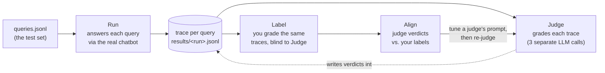

# Evaluation Framework Guide

This explains `evals/` — what it measures, why it's built the way it is, and what each screen on the **Evals** page (`streamlit run ui/resolver_support.py` → sidebar → Evals) does. It assumes you've read the root [README.md](../README.md) (Phase 1 architecture) and have the app ingested and runnable.

> **Status:** Implemented and working — Run, deterministic checks, 3 LLM judges, Label, Align, and a report/UI. Not yet done: business-outcome metrics, agent/tool-call metrics (the framework already has a slot for these — see [Not Yet Measured](#not-yet-measured)).

---

## Table of Contents

- [Why This Exists](#why-this-exists)
- [The Mental Model: Run → Judge → Label → Align](#the-mental-model-run--judge--label--align)
- [Worked Example, Start to Finish](#worked-example-start-to-finish)
- [The Four Screens](#the-four-screens)
- [What Gets Measured](#what-gets-measured)
- [The Test Set: What's Validated vs. What Isn't](#the-test-set-whats-validated-vs-what-isnt)
- [Choosing Models](#choosing-models)
- [Known Findings (Current State)](#known-findings-current-state)
- [File Reference](#file-reference)
- [CLI Quick Reference](#cli-quick-reference)
- [Recommended Workflow](#recommended-workflow)
- [FAQ](#faq)
- [Not Yet Measured](#not-yet-measured)

---

## Why This Exists

Manually typing questions into the chatbot and eyeballing the answers doesn't scale, isn't repeatable, and can't tell you if a change made things better or worse. This framework replaces that with:

- A **fixed test set** (`evals/datasets/queries.jsonl`) so every run is measured against the same questions.
- **Deterministic checks** (plain code, free, instant) for anything that has an objectively correct answer.
- **LLM judges** for the things only an LLM can assess (is this answer faithful to the evidence?) — each judge scoped to one narrow question, answering binary pass/fail, never a 1–5 score (LLMs cluster toward the middle of a scale; binary forces a decision).
- A **human alignment step**: you label a sample of answers yourself, and the framework tells you where the judges disagree with you, so you can tune the judge prompts until you'd trust them on data you haven't personally read.
- **Latency and token tracking** on every run, because response time is itself a metric — a slow-but-correct agent still loses users.

Everything here is UI-agnostic: the Streamlit **Evals** page calls the exact same functions the CLI does, so a terminal run and a UI run of the same test set always agree.

---

## The Mental Model: Run → Judge → Label → Align

Four separate passes over the same data, each with a different job and different inputs:



- **Run** talks to the real chatbot (`RAGService`) and to nothing else. It answers the questions and records the objective facts: what was retrieved, what was answered, how long it took, how many tokens it used. It also runs the free deterministic checks here.
- **Judge** never talks to the chatbot. It reads the trace Run already produced (question + evidence + answer) and makes 3 separate, narrowly-scoped LLM calls to grade it.
- **Label** is you, reading the same trace, with the judge scores hidden so they can't bias you.
- **Align** compares Judge's verdicts to your labels and shows exactly where they disagree, so you know which judge prompt to edit.

The practical reason Run and Judge are split: **re-answering costs a real chatbot call (retrieval + generation); re-judging only costs the grading call.** After you edit a judge's prompt, `evals.judge_run` re-grades the *same* traces without re-asking the chatbot — your human labels stay valid because the answers didn't change, only the grading did.

---

## Worked Example, Start to Finish

One real trace, trimmed, from an actual run (question generated from ticket `MESOS-1873`):

**1. Run produces this** (`checks` filled in, `judgments` still empty):

```json
{
  "query_id": "q002",
  "chat_model": "gpt-4o-mini",
  "question": "...passing arguments with the command executor set to shell=false is causing failures...",
  "answer": "Suggested Resolution: ...avoid passing task-related arguments... Supporting Evidence: 1. ...MESOS-1873...",
  "retrieved_ticket_ids": ["MESOS-1873", "MESOS-7703", "MESOS-1873", "MESOS-1873", "MESOS-3738"],
  "retrieval_seconds": 2.0, "generation_seconds": 3.6,
  "input_tokens": 1750, "output_tokens": 234,
  "checks": {
    "retrieval_hit": true, "citations_valid": true,
    "abstention_correct": false, "within_latency": true
  },
  "judgments": {}
}
```

**2. Judge adds this**, from 3 independent calls, each with its own system prompt (`evals/judges/prompts/*.md`) and only the inputs relevant to that one metric:

```json
"judgments": {
  "context_relevance": {"score": 1, "reason": "Evidence 1 directly addresses the issue with shell=false..."},
  "faithfulness":       {"score": 1, "reason": "All claims and cited ticket IDs are supported by the evidence."},
  "answer_relevancy":   {"score": 1, "reason": "The answer provides a direct resolution and next steps..."}
}
```

`answer_relevancy` never sees the retrieved evidence at all — it can only judge whether the answer addresses the question, not whether it's grounded. `context_relevance` never sees the answer — it can only judge whether the evidence was worth retrieving. This isolation is deliberate: a bad context score shouldn't be able to bias a faithfulness score.

**3. You label it** on the Label tab (judge scores hidden while you do):

```json
{"trace_id": "...:q002", "verdict": "pass", "reason": "correct fix and cites MESOS-1873"}
```

**4. Align compares them**:

```
metric    n   agree   TP  TN  FP  FN
overall   1   100%     1   0   0   0
```

`TP` = judge said pass, you said pass. `FP` = judge said pass, you said fail (judge too lenient). `FN` = judge said fail, you said pass (judge too strict). One label isn't statistically meaningful — you want ~20–30 before trusting this table.

---

## The Four Screens

The Streamlit **Evals** page (`ui/views/evals.py`) has four tabs. Each one is a thin UI wrapper around the same functions the CLI uses — nothing here has logic of its own.

### ▶ Run
Edit the test set as a table (add/delete/reword rows, change `kind`, save), pick the **chat model** and the **judge model**, set `k` (chunks retrieved) and a latency cap, then click **Run evals**. This calls `evals.run.run_eval()` — the exact function `python -m evals.run` calls — against the real chatbot. Produces a new `results/<run_id>.jsonl` file and auto-selects it.

### 📈 Metrics
The dashboard: query count, latency p50/p95, tokens/query, tool calls/query; pass-rate tiles for each judge and each check; a "pass rate by query kind" table (same metrics sliced by `answerable` / `unanswerable` / `filtered`, so you can see *where* failures concentrate instead of one blended number); a trace table you can filter to failing rows and click into for the full question/evidence/answer/verdicts; and a **"Compare with"** run picker in the sidebar that shows deltas against another run — this is how you check whether a change (new prompt, new model, new chunking) actually helped.

### 🏷 Label
One trace at a time: question, evidence, answer — judge verdicts deliberately hidden so they can't bias you. You give pass/fail, a short reason, and an optional failure tag (reuse the same tag across traces so failures can be counted later). Saving jumps to the next unlabeled trace. This is `evals.label`'s logic, over the same trace file.

### 🎯 Align
The judge-vs-you comparison table (see the worked example above), a list of every disagreement with both reasons side by side, and a **prompt editor** for each judge — edit the system prompt, then **"Save & re-judge this run"** re-grades the same traces with the new prompt (only that one metric; your labels and the other two judges' scores are untouched).

---

## What Gets Measured

| Layer | Metric | How it's computed | What it actually checks |
|---|---|---|---|
| Retrieval | `retrieval_hit` | code | The ticket the query was generated from was among the retrieved chunks. `None` (n/a) for `unanswerable` queries, which have no expected ticket. |
| Retrieval | `context_relevance` | LLM judge | The retrieved evidence contains information genuinely useful for the question — sees question + evidence only, never the answer. |
| Answer | `faithfulness` | LLM judge | Every claim and cited ticket ID in the answer is supported by the retrieved evidence — sees question + evidence + answer. |
| Answer | `answer_relevancy` | LLM judge | The answer addresses the question that was asked — sees question + answer only, never the evidence. |
| Behaviour | `citations_valid` | code | Every `PROJECT-1234`-style ID cited in the answer was actually retrieved (catches invented citations). |
| Behaviour | `abstention_correct` | code | `unanswerable` queries got declined; `answerable`/`filtered` queries did not. Pattern-matches on the system prompt's refusal phrase ("not enough supporting evidence"). |
| Behaviour | `has_required_sections` | code | The answer has both "Suggested Resolution" and "Supporting Evidence" sections (`None`/n/a if the answer abstained). |
| Performance | `within_latency` | code | Total response time was under the configured cap (default 10s, set per run). |
| Performance | latency / tokens | measured | `retrieval_seconds`, `generation_seconds`, `total_seconds`, `input_tokens`, `output_tokens` — exact numbers from the real call, not estimates. |
| Performance | `tool_calls` | measured | Present in every trace, currently always `None` — see [Not Yet Measured](#not-yet-measured). |

**A pass on every metric does not mean the answer is good** — see the next section. Each metric checks one narrow thing; none of them alone is "is this answer good."

---

## The Test Set: What's Validated vs. What Isn't

The framework validates the dataset's **structure** at save time (`rows_to_queries` in `evals/schemas.py`): the `id` is unique, `kind` is one of `answerable` / `unanswerable` / `filtered`, and `filters` parses as a JSON object. That's the entire check.

It cannot and does not validate **meaning** — whether the `question` text is coherent, or whether `expected_ticket_id`/`filters` actually correspond to what the question describes. A malformed row doesn't crash the run; it produces a low-signal trace that quietly blends into your aggregate numbers instead of standing out as an obvious failure.

Concretely, tested with a garbage row (`question: "balabalbalbababababa"`, `expected_ticket_id: MESOS-2935`, `filters: {"component": "fetcher"}`):

- The embedding model happily vectorized the gibberish (embedding models don't validate meaning either).
- Retrieval, constrained by the filter, returned *some* fetcher tickets — not the expected one (`retrieval_hit` correctly failed).
- The chatbot did **not** say "I don't understand this question" — it fabricated a fully-formed, confident "Suggested Resolution" out of whatever evidence it got.
- **5 of 7 signals still showed green**: `citations_valid`, `has_required_sections`, `abstention_correct` (the row is `answerable`, and it did attempt an answer — "pass"), `faithfulness` (the claims did match the cited ticket's literal text), and `answer_relevancy` (the judge said "the answer provides concrete next steps," never checking whether the *question* was coherent in the first place).
- Only `context_relevance` caught it cleanly, because its prompt specifically asks "does the evidence relate to a real described problem" against the literal question text.

**Takeaway for whoever edits the test set:** a bad row won't announce itself. Spot-check individual traces (the trace table on the Metrics tab, or the Label tab) rather than trusting the aggregate tiles alone — especially after hand-editing or generating a fresh batch of queries.

---

## Choosing Models

Two independent model choices, both offered wherever the `model_choices()` picker appears (`app/config/settings.py`), sourced from `AVAILABLE_MODELS` in `.env` and defaulting to `CHAT_MODEL` / `JUDGE_MODEL`:

- **Chat model** (Run tab) — the model that *answers* the questions. This is what a real user would get. Change it to compare answer quality, latency, or cost between models — use the Metrics tab's **"Compare with"** picker to see the pass-rate and latency deltas between two runs on two different chat models side by side.
- **Judge model** (Run tab and Align tab) — the model that *grades* the answers. A stronger judge model is sometimes worth it even with a cheap chat model, because a weak judge can miss subtle faithfulness violations. If your Align numbers stay poor no matter how you edit a judge's prompt, try a stronger judge model — that tells you whether the problem is the prompt or the judge's own reasoning limit.

CLI equivalents: `evals.run --chat-model / --judge-model`, `evals.judge_run --judge-model`.

---

## Known Findings (Current State)

Logged here so the team doesn't have to rediscover these from scratch. Current as of the last full 31-query run (`gpt-4o-mini` for both chat and judge):

1. **The chatbot doesn't reliably decline off-topic questions.** Of 6 `unanswerable` queries (Jenkins, Elasticsearch, Nginx, Redis, PostgreSQL, Terraform), only 1 correctly abstained. The other 5 got a confident, fully-formatted "Suggested Resolution" built from generic knowledge about the *wrong* technology, with an unrelated Mesos ticket cited as "supporting evidence" to make it look grounded. `abstention_correct` for `unanswerable` queries was 17%. **Not yet fixed** — candidate fixes: a similarity-score threshold before calling the LLM at all (deterministic, no reliance on the LLM following an instruction), or an explicit "is this evidence even on-topic" step in the prompt.
2. **`faithfulness` has a blind spot**: it only checks whether an answer's claims match the *literal content* of the cited evidence, not whether that evidence was relevant to the question at all. In the off-topic cases above, `faithfulness` still passed 4 of 6 — a technically-accurate quote from the wrong ticket still passes. `context_relevance` is the metric actually catching topic mismatch (it went 0/6 correctly on those same queries).
3. **`answer_relevancy` has the same kind of blind spot**: it checks "does the answer address the question," not "should the question have been answerable at all." It doesn't require the question itself to be coherent or in-domain before grading the answer against it (confirmed with the garbage-row test above).
4. **`retrieval_hit` was 60%** on the last full run — worth investigating whether this is a real retrieval weakness or an artifact of generated queries having several equally-valid candidate tickets (the check only accepts the one exact source ticket).

---

## File Reference

```
evals/
├── schemas.py              # EvalQuery, Trace, JudgeVerdict, HumanLabel + JSONL read/write helpers
├── checks.py                # the 5 deterministic (code-only) checks
├── judges/
│   ├── base.py               # Judge class, judge_traces() (parallel), verdict parsing
│   └── prompts/               # one editable .md system prompt per judge metric -- tune these
├── generate_queries.py     # drafts queries.jsonl from real tickets in the vector store
├── run.py                   # run_eval() -- answers queries, runs checks (CLI: python -m evals.run)
├── judge_run.py              # re-judge an existing run's traces without re-answering
├── label.py                  # terminal labeling tool (the UI Label tab wraps this)
├── align.py                  # judge-vs-human comparison (the UI Align tab wraps this)
├── report.py                  # text report + the data functions the UI Metrics tab uses
├── datasets/queries.jsonl   # THE TEST SET -- hand-edited, committed to git
├── labels/human_labels.jsonl # your pass/fail labels -- committed to git
└── results/*.jsonl           # one file per run -- gitignored, regenerate anytime
```

Each run's filename is `<timestamp>-<dataset>-<chat_model>.jsonl`, e.g.
`20260925-100829-team_test_cases-gpt-4o-mini.jsonl` — timestamp first (so the Metrics tab's
"Selected run" / "Compare with" pickers, and `evals.report`'s own listing, stay newest-first
under a plain filename sort), then which dataset produced it, then which model answered it.
With more than one dataset file now selectable (see the Run tab's picker / `--dataset`), the
filename is the only place that records which one a given run came from, so it's written to
be read at a glance rather than requiring you to open the file and guess from its `query_id`
prefixes (`TC-01` vs `q001`).

---

## CLI Quick Reference

All commands run from the repo root and need a real `OPENAI_API_KEY` in `.env`.

```bash
# 1. Draft a test set from real tickets, then hand-edit it (you are the SME)
python -m evals.generate_queries --n 30

# 2. Answer every query, run checks + judges, print a report
python -m evals.run
python -m evals.run --chat-model gpt-4o --judge-model gpt-4o-mini --k 8 --no-judge   # options

# 3. Label pass/fail yourself (judge verdicts hidden)
python -m evals.label evals/results/<run>.jsonl
python -m evals.label evals/results/<run>.jsonl --per-metric   # also label context_relevance etc.

# 4. See where the judges disagree with you
python -m evals.align evals/results/<run>.jsonl

# Edit evals/judges/prompts/<metric>.md, then re-judge the SAME traces (labels stay valid):
python -m evals.judge_run evals/results/<run>.jsonl
python -m evals.judge_run evals/results/<run>.jsonl --metrics faithfulness --judge-model gpt-4o

# Re-print the report any time (add --labels to include your label summary)
python -m evals.report evals/results/<run>.jsonl
```

Or do all of the above from the **Evals** page in the UI — same functions underneath.

---

## Recommended Workflow

1. **Generate + hand-edit** the test set once (`evals.generate_queries`, then review every row — delete odd ones, reword ones that just echo their source ticket, add real-user-style questions). Keep a mix of `answerable`, `filtered`, and `unanswerable`.
2. **Run** it (Run tab or `evals.run`) to get a baseline.
3. **Label** ~20–30 traces yourself.
4. **Align** — see where the judges disagree with you, edit the relevant `evals/judges/prompts/*.md`, then `evals.judge_run` to re-grade and re-check alignment. Repeat until agreement is acceptable.
5. **Fix what the evals found** (e.g. the abstention issue above), then run again and use **"Compare with"** on the Metrics tab to confirm the fix actually moved the numbers, not just that it "feels" better.
6. **Commit** `evals/datasets/queries.jsonl` and `evals/labels/human_labels.jsonl` whenever they change — they're project config, not scratch output, and the team should be working from the same test set and labels.
7. Re-run after any change to the system prompt, chunking, retrieval, or model — this is what turns "we think it's better" into a number.

---

## FAQ

**Why does Judge make 3 separate LLM calls instead of 1 that returns all 3 scores?**
So a bad score on one metric can't bias another, and so you can tune one judge's prompt without any risk of moving the other two. See `METRIC_INPUTS` in `evals/judges/base.py` — each judge is shown only the inputs it needs.

**Why is `queries.jsonl` committed to git instead of gitignored?**
It's project config the whole team should see and version, same as any other config file. Only `evals/results/` (regenerated run output) is gitignored.

**What happens if a query in the test set is nonsense or mislabeled?**
Nothing crashes — see [The Test Set: What's Validated vs. What Isn't](#the-test-set-whats-validated-vs-what-isnt). It quietly produces a low-signal trace that can dilute your aggregate numbers without obviously flagging itself. Spot-check traces, don't just trust the tiles.

**A metric passed but the answer still looks wrong (or vice versa) — is that a bug?**
Probably not — each metric checks one narrow thing (see [What Gets Measured](#what-gets-measured) and [Known Findings](#known-findings-current-state) for two concrete examples: `faithfulness` and `answer_relevancy` both have real blind spots around off-topic questions). This is exactly what the Align step and human labeling are for — trust your own read of the answer over any single metric.

**How many labels do I need before I trust the judges?**
~20–30 is a reasonable starting point for a project this size — enough to catch a systematically biased judge prompt without spending a full day labeling. More helps but has diminishing returns; if a judge is still misaligned after 30, the fix is almost always the prompt, not more labels.

**Why does `evals.run` answer queries one at a time instead of in parallel?**
Because latency is itself a measured metric — running queries concurrently would distort the timing numbers. Judging *is* parallelized (default 4 workers), since judge latency isn't something we're trying to measure accurately.

---

## Not Yet Measured

- **Tool calls** — `Trace.tool_calls` exists and is already surfaced in the report and UI, currently always `None`. Once an agentic flow exists (see [AGENTIC_PHASE2_GUIDE.md](AGENTIC_PHASE2_GUIDE.md)), populate it and the same tiles/tables light up with no other changes needed.
- **Business-outcome metrics** — e.g. "did this actually resolve the ticket," thumbs up/down from real users. Everything here measures technical quality (relevance, faithfulness, latency); it does not measure whether the app is achieving its actual goal for users. Worth raising with the team as a capstone extension.
- **Multi-turn / agent trajectory metrics** — order of tool calls, retry behavior, whether the agent asked a clarifying question when it should have. Not applicable yet since Phase 1 is single-shot RAG.
