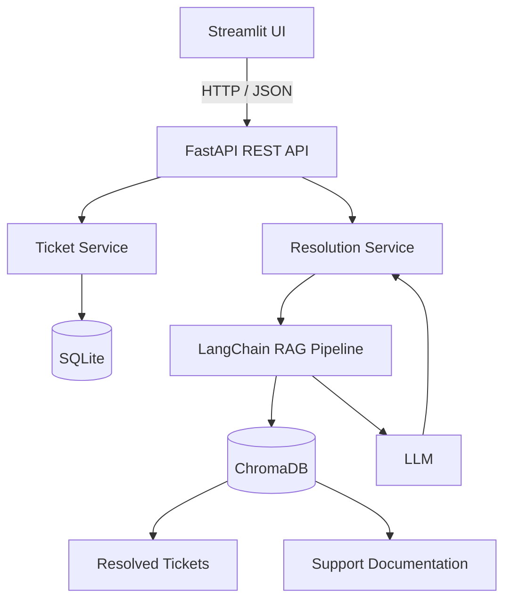
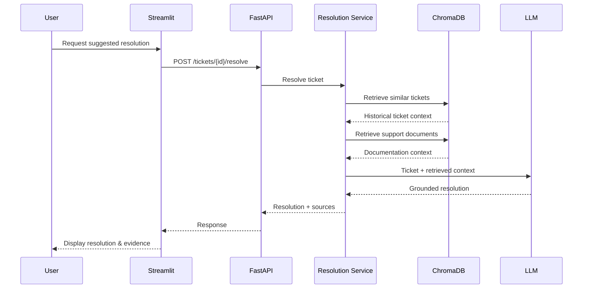
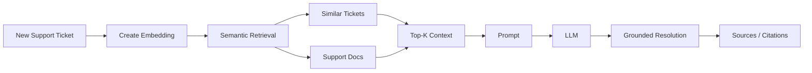
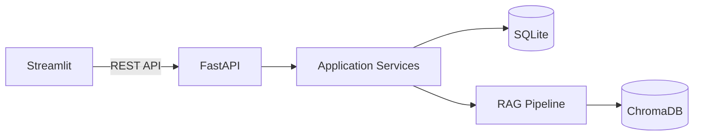
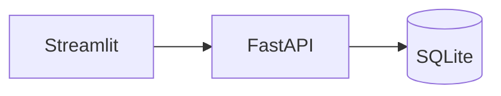
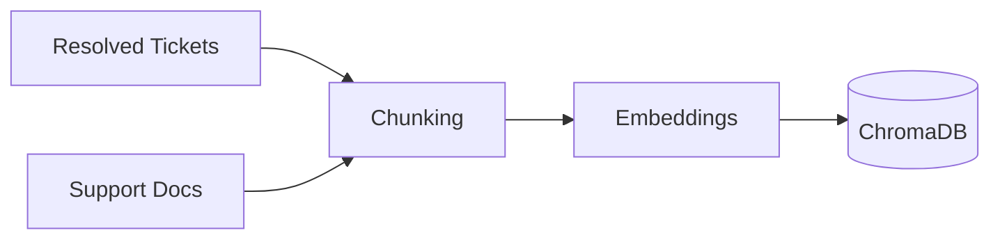
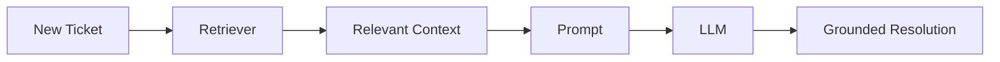
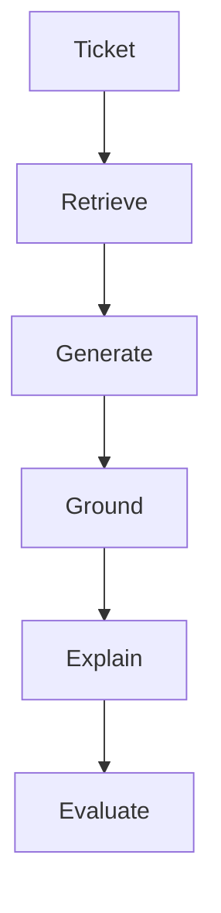
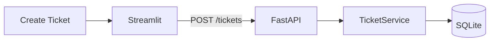

# AI Support Ticket Resolver

A RAG-powered assistant for grounded support ticket resolution and triage.

AI Support Ticket Resolver helps support engineers investigate and resolve new support issues by retrieving semantically similar historical tickets and relevant support documentation, then using an LLM to generate a grounded suggested resolution with supporting evidence.

Instead of acting as a generic chatbot, the system focuses on answering a more useful question:

> Have we seen this problem before, and how did we solve it?

---

## Key Capabilities

* 🔎 Similar Ticket Retrieval — Find previously resolved tickets that describe semantically similar issues.
* 📚 Knowledge Base Retrieval — Search support documentation, troubleshooting guides, FAQs, and runbooks.
* 🤖 Grounded Resolution Generation — Generate suggested resolutions using retrieved evidence rather than relying only on the LLM's internal knowledge.
* 🔗 Source Attribution — Show the historical tickets and documentation supporting each suggested resolution.
* ⚠️ Conflict & Staleness Detection — Warn when older documentation may conflict with newer support information.
* 💬 Human Feedback — Allow support engineers to evaluate generated suggestions.
* 📊 RAG Evaluation — Measure retrieval quality, groundedness, citation correctness, and overall response quality.

---

## Why This Project?

Support organizations accumulate valuable knowledge over time across:

* Resolved support tickets
* Troubleshooting documentation
* Runbooks
* FAQs
* Operational procedures

The challenge is that this knowledge is often difficult to discover.

A newly reported issue might describe the same underlying problem using completely different wording.

For example:

**New ticket**

> VPN stopped working after the user changed their corporate password.

**Previously resolved ticket**

> Authentication failure occurs when cached VPN credentials no longer match the identity provider after a password reset.

Traditional keyword search may struggle to connect these two issues.

Semantic retrieval using embeddings can identify their similarity and surface the previous resolution.

The system can then provide the LLM with relevant historical evidence and generate a suggested resolution grounded in that information.

---

## High-Level Architecture



The architecture intentionally keeps the frontend, application backend, and AI/RAG components separated.

---

## Request Flow

A typical ticket-resolution request follows this path:



---

## RAG Pipeline

The initial implementation intentionally uses a straightforward RAG pipeline rather than an agentic workflow.



The goal is to keep the first implementation understandable, measurable, and reliable before introducing more complex orchestration.

---

## Tech Stack

| Area | Technology |
|---|---|
| Language | Python |
| Frontend | Streamlit |
| Backend API | FastAPI |
| ASGI Server | Uvicorn |
| Application Database | SQLite |
| ORM | SQLAlchemy |
| Validation | Pydantic |
| RAG Framework | LangChain |
| Vector Database | ChromaDB |
| Retrieval | Embeddings / Semantic Search |
| Generation | LLM |
| Evaluation | RAG retrieval & response evaluation |

---

## Frontend / Backend Separation

Streamlit acts purely as the frontend client.

It does not directly access SQLite, ChromaDB, or the RAG implementation.



This keeps the frontend replaceable.

For example, Streamlit could eventually be replaced with React or another UI without requiring changes to the core backend.

---

## Data Storage

The application uses SQLite and ChromaDB for different purposes.

### SQLite

SQLite stores application state such as:

* Support tickets
* Ticket status
* Priority
* Generated resolutions
* User feedback
* Processing state
* Created and updated timestamps

Example:

```
Ticket
────────────────────
id
title
description
priority
status
created_at
updated_at
```

### ChromaDB

ChromaDB stores embedded knowledge used by the retrieval pipeline.

This includes:

* Historical resolved tickets
* Support documentation
* Troubleshooting guides
* Runbooks
* FAQs

Documents can include metadata such as:

```json
{
  "source_type": "resolved_ticket",
  "ticket_id": "INC-1234",
  "product": "VPN",
  "created_at": "2026-08-14"
}
```

Metadata can later be used for filtering, source attribution, and staleness detection.

---

## Project Structure

```
ai-support-ticket-resolver/
│
├── frontend/
│   └── streamlit_app/
│       ├── app.py
│       ├── pages/
│       └── api_client.py
│
├── backend/
│   └── app/
│       ├── api/
│       │   └── tickets.py
│       │
│       ├── schemas/
│       │   └── ticket.py
│       │
│       ├── models/
│       │   └── ticket.py
│       │
│       ├── repositories/
│       │   └── ticket_repository.py
│       │
│       ├── services/
│       │   ├── ticket_service.py
│       │   ├── resolution_service.py
│       │   └── retrieval_service.py
│       │
│       ├── rag/
│       │   ├── ingestion.py
│       │   ├── chunking.py
│       │   ├── embeddings.py
│       │   ├── vector_store.py
│       │   ├── retriever.py
│       │   ├── prompts.py
│       │   └── resolution_chain.py
│       │
│       ├── db/
│       │   └── database.py
│       │
│       └── main.py
│
├── data/
│   ├── resolved_tickets/
│   ├── support_docs/
│   └── evaluation/
│
├── scripts/
│   └── ingest_knowledge_base.py
│
├── tests/
│   ├── unit/
│   └── integration/
│
├── docs/
│
├── .env.example
├── .gitignore
├── requirements.txt
├── docker-compose.yml
└── README.md
```

---

## Initial API Design

The backend exposes REST APIs through FastAPI.

### Health Check

`GET /health`

### Create Ticket

`POST /api/v1/tickets`

Example request:

```json
{
  "title": "VPN connection fails",
  "description": "User receives an authentication error after resetting their password.",
  "priority": "medium"
}
```

Example response:

```json
{
  "id": 101,
  "title": "VPN connection fails",
  "status": "open",
  "priority": "medium"
}
```

### List Tickets

`GET /api/v1/tickets`

### Get Ticket

`GET /api/v1/tickets/{ticket_id}`

### Resolve Ticket

`POST /api/v1/tickets/{ticket_id}/resolve`

Runs the RAG pipeline and generates a grounded suggested resolution.

### Find Similar Tickets

`GET /api/v1/tickets/{ticket_id}/similar`

Returns semantically similar historical tickets.

### Submit Feedback

`POST /api/v1/tickets/{ticket_id}/feedback`

Stores user feedback about the generated resolution.

---

## Example Resolution

A future response from the system may look similar to:

```
Ticket #101
VPN authentication fails after password reset.

Suggested Resolution
────────────────────────────────────────
1. Clear cached VPN credentials.
2. Reauthenticate through corporate SSO.
3. Restart the VPN client.
4. Re-enroll the device if authentication
   continues to fail.

Supporting Evidence
────────────────────────────────────────
INC-821
VPN authentication failure after password reset
Similarity: 92%

INC-771
Cached credentials causing VPN login failure
Similarity: 87%

Documentation
VPN Authentication Troubleshooting Guide

Potential Conflict
────────────────────────────────────────
⚠ Older documentation recommends resetting the
local VPN certificate.
Recent resolved tickets indicate that device
re-enrollment has replaced this procedure.
```

The objective is not simply to produce an answer, but to show why the answer was generated.

---

## Development Roadmap

### Milestone 1 — Application Foundation

Build the first end-to-end vertical slice:



**Deliverables**

* Repository setup
* Python environment
* FastAPI application
* Uvicorn development server
* /health endpoint
* SQLite integration
* Ticket model
* Create Ticket API
* List Tickets API
* Basic Streamlit UI
* Streamlit → FastAPI communication

**Success Criteria**

A user can create a ticket from Streamlit, FastAPI receives the request, and the ticket is persisted in SQLite.

---

### Milestone 2 — Knowledge Base & Retrieval

Build the RAG knowledge base.



**Deliverables**

* Synthetic resolved-ticket dataset
* Synthetic support documentation
* Document ingestion
* Chunking strategy
* Embedding generation
* ChromaDB persistence
* Metadata strategy
* Semantic retrieval
* Similar-ticket search

**Success Criteria**

Given a support issue, the system retrieves relevant historical tickets and support documentation.

---

### Milestone 3 — Grounded Resolution Generation

Connect retrieval to the LLM.



**Deliverables**

* LangChain retrieval pipeline
* Prompt templates
* LLM integration
* Resolution generation
* Source attribution
* Similar-ticket results
* Resolve Ticket API
* Resolution UI

**Success Criteria**

A support engineer can request an AI-generated resolution that is grounded in retrieved support knowledge.

---

### Milestone 4 — Reliability

Improve the system's ability to recognize uncertainty and conflicting information.

**Deliverables**

* Conflict detection
* Documentation staleness detection
* Insufficient-context handling
* Unsupported-answer detection
* User feedback

The system should prefer:

> "There is not enough supporting evidence to recommend a resolution."

over confidently generating an unsupported answer.

---

### Milestone 5 — Evaluation

Evaluate both retrieval and generation quality.

Potential metrics include:

* Retrieval Hit Rate
* Recall@K
* Source relevance
* Citation correctness
* Groundedness
* Resolution quality
* Unsupported-answer rate

Experiments can compare:

* Chunk size
* Chunk overlap
* Top-K
* Embedding models
* Prompt strategies
* Retrieval strategies

The goal is to make changes based on measured RAG performance, not just subjective output quality.

---

## Current Scope

The core capstone focuses on building a reliable RAG application.



The initial implementation intentionally does not require agents.

---

## Future / Stretch Goals

Once the core RAG application is complete and evaluated, possible extensions include:

* LangGraph workflow orchestration
* Tool calling
* Model Context Protocol (MCP)
* Specialized agents
* Automated ticket categorization
* Automated ticket routing
* Human-in-the-loop approval workflows
* Jira integration
* ServiceNow integration
* Zendesk integration
* Production vector database
* Hybrid search
* Reranking

These are potential extensions and are not dependencies for the initial implementation.

---

## Team Development

The project is designed so multiple contributors can work in parallel.

| Workstream | Responsibilities |
|---|---|
| Platform / Backend | FastAPI, SQLite, SQLAlchemy, REST APIs |
| Frontend | Streamlit, ticket creation, ticket views, resolution UI |
| RAG / Knowledge Base | Data, chunking, embeddings, ChromaDB, retrieval |
| AI / Evaluation | Prompting, LangChain pipeline, grounding, evaluation |

API contracts and shared data models should be agreed upon before parallel implementation begins.

---

## First Development Target

Before introducing LangChain or LLM calls, the first target is:



### Definition of Done

* Repository created
* Python project initialized
* FastAPI starts successfully
* /health returns 200 OK
* SQLite database initializes
* POST /api/v1/tickets creates a ticket
* GET /api/v1/tickets returns tickets
* Streamlit application starts
* Streamlit communicates with FastAPI
* Ticket created through Streamlit is persisted in SQLite

Once this works end-to-end, the RAG implementation begins.

---

## Definition of Capstone Success

A successful final demo should allow a user to:

1. Create a new support ticket.
2. View the ticket.
3. Request an AI-suggested resolution.
4. Retrieve semantically similar historical tickets.
5. Retrieve relevant support documentation.
6. Generate a grounded suggested resolution.
7. Inspect the sources supporting the resolution.
8. Receive warnings about potentially conflicting or stale information.
9. Provide feedback on the generated resolution.
10. Demonstrate measurable retrieval and response quality.

---

## Guiding Principle

Build the smallest complete system first.

Get the basic ticket workflow working.

Then add retrieval.

Then generation.

Then grounding.

Then evaluation.

Only after the core system works reliably should additional orchestration or agentic capabilities be considered.
