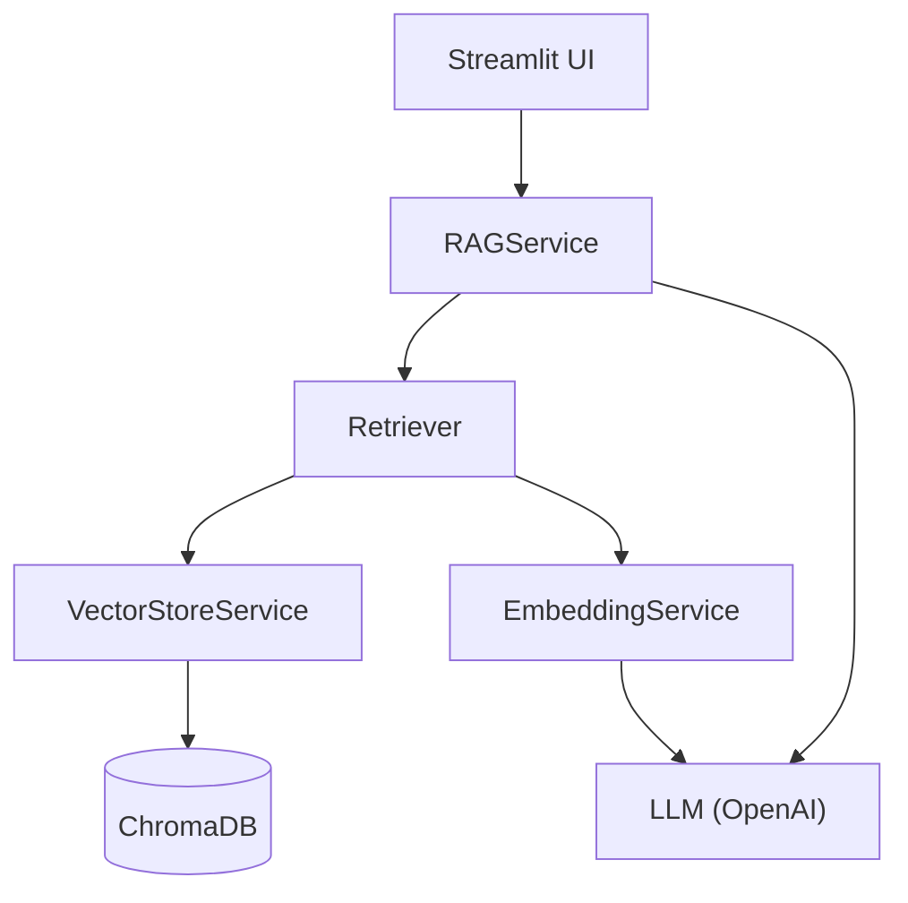
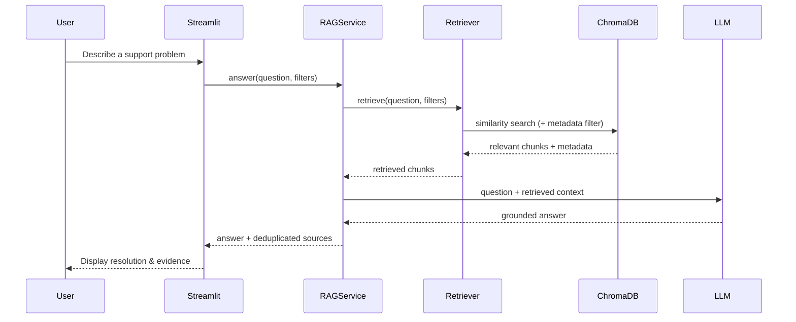
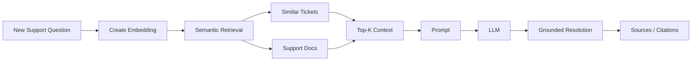
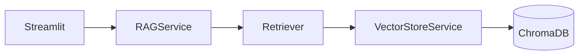
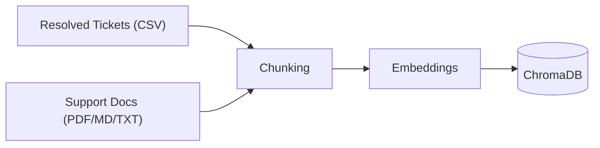
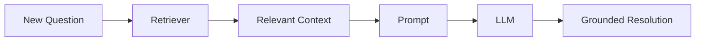
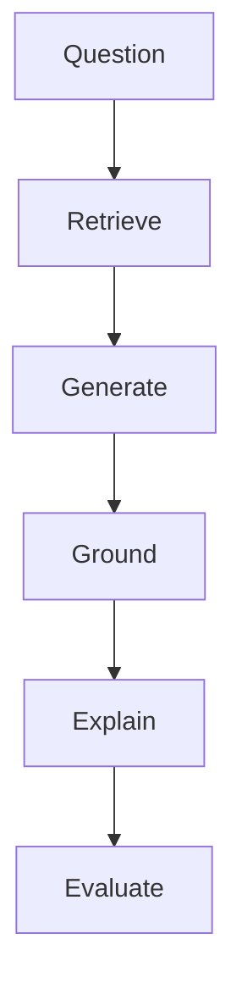
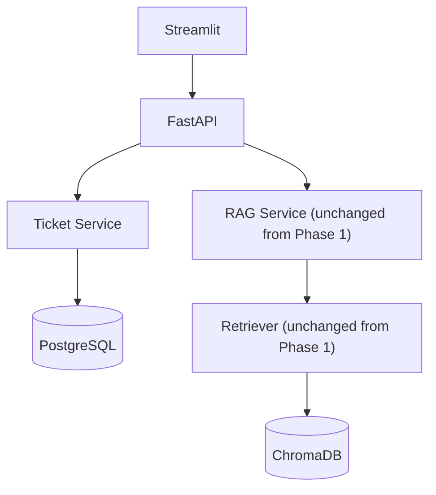
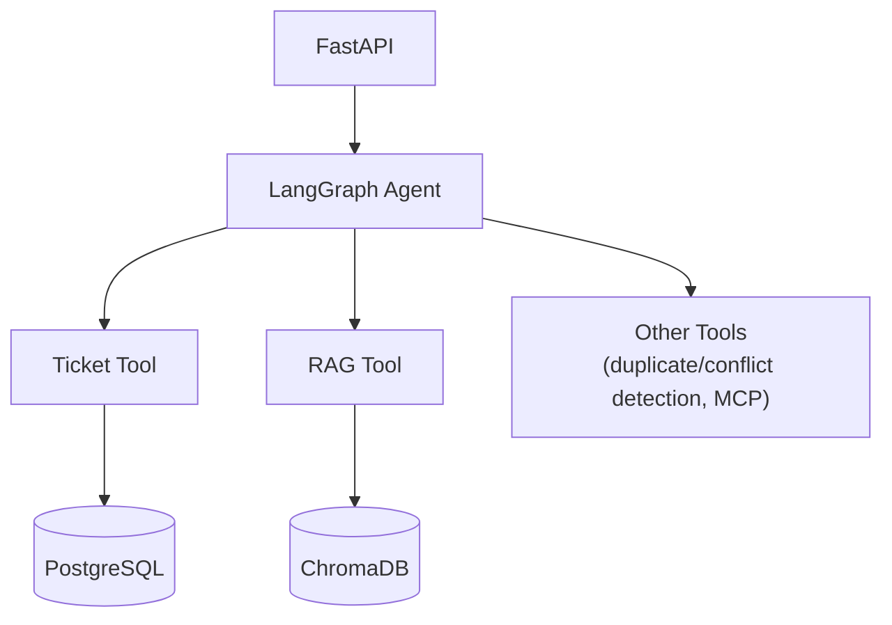

# AI Support Ticket Resolver

A RAG-powered assistant for grounded support ticket resolution and triage.

AI Support Ticket Resolver helps support engineers investigate and resolve new support issues by retrieving semantically similar historical tickets and relevant support documentation, then using an LLM to generate a grounded suggested resolution with supporting evidence.

Instead of acting as a generic chatbot, the system focuses on answering a more useful question:

> Have we seen this problem before, and how did we solve it?

> **Status:** Phase 1 (RAG foundation + Streamlit chatbot) is implemented. FastAPI, a ticket database, LangGraph/agents, duplicate/conflict detection, and MCP integrations are deliberately deferred to Phase 2 — see [Phase 2 (Deferred)](#phase-2-deferred). For hands-on setup/usage, see the root [README.md](../README.md).

---

## Key Capabilities

* 🔎 Similar Ticket Retrieval — Find previously resolved tickets that describe semantically similar issues. **(Phase 1 — implemented)**
* 📚 Knowledge Base Retrieval — Search support documentation, troubleshooting guides, FAQs, and runbooks. **(Phase 1 — implemented)**
* 🤖 Grounded Resolution Generation — Generate suggested resolutions using retrieved evidence rather than relying only on the LLM's internal knowledge. **(Phase 1 — implemented)**
* 🔗 Source Attribution — Show the historical tickets and documentation supporting each suggested resolution. **(Phase 1 — implemented)**
* 📊 RAG Evaluation — Measure retrieval quality, groundedness, citation correctness, and overall response quality. **(Phase 1 — planned, not yet built)**
* ⚠️ Conflict & Staleness Detection — Warn when older documentation may conflict with newer support information. **(Phase 2 — deferred)**
* 💬 Human Feedback — Allow support engineers to evaluate generated suggestions. **(Phase 2 — deferred; needs persisted ticket/feedback storage)**

---

## Why This Project?

Support organizations accumulate valuable knowledge over time across:

* Resolved support tickets
* Troubleshooting documentation
* Runbooks
* FAQs
* Operational procedures

The challenge is that this knowledge is often difficult to discover.

A newly reported issue might describe the same underlying problem using completely different wording.

For example:

**New ticket**

> VPN stopped working after the user changed their corporate password.

**Previously resolved ticket**

> Authentication failure occurs when cached VPN credentials no longer match the identity provider after a password reset.

Traditional keyword search may struggle to connect these two issues.

Semantic retrieval using embeddings can identify their similarity and surface the previous resolution.

The system can then provide the LLM with relevant historical evidence and generate a suggested resolution grounded in that information.

---

## High-Level Architecture (Phase 1)



There is no API/backend layer in Phase 1 — Streamlit calls `RAGService` directly in-process. A FastAPI layer sitting between Streamlit and these services is a Phase 2 addition (see [Phase 2](#phase-2-deferred)); the services are already structured as plain, framework-agnostic Python classes so that addition doesn't require rewriting them.

---

## Request Flow (Phase 1)

A typical question-answering request follows this path:



---

## RAG Pipeline

The implementation intentionally uses a straightforward RAG pipeline rather than an agentic workflow.



The goal is to keep the first implementation understandable, measurable, and reliable before introducing more complex orchestration (LangGraph/agents — Phase 2).

---

## Tech Stack

| Area | Technology | Phase |
|---|---|---|
| Language | Python 3.11+ | 1 |
| Frontend | Streamlit | 1 |
| RAG Framework | LangChain | 1 |
| Vector Database | ChromaDB | 1 |
| Retrieval | Embeddings / Semantic Search | 1 |
| Embeddings | OpenAI | 1 |
| Generation | OpenAI LLM | 1 |
| Config | python-dotenv | 1 |
| Testing | pytest | 1 |
| Backend API | FastAPI + Uvicorn | 2 |
| Application/Ticket Database | PostgreSQL | 2 |
| Orchestration | LangGraph | 2 |
| Evaluation | RAG retrieval & response evaluation | 1 (planned) |

---

## UI / Service Separation

Streamlit acts purely as a thin client over `RAGService`.

It does not directly access ChromaDB or call OpenAI itself.



```
GOOD:  Streamlit → RAGService → Retriever → VectorStoreService → ChromaDB
BAD:   Streamlit → (Chroma calls, OpenAI calls scattered throughout)
```

This keeps the frontend replaceable, and is what lets a Phase 2 FastAPI layer be inserted between Streamlit and `RAGService` later without rewriting retrieval/RAG logic — Streamlit would call FastAPI, and FastAPI would call the same `RAGService.answer(...)`.

---

## Data Storage

Phase 1 uses **ChromaDB only**. There is no ticket database yet — Phase 1 is a question-answering chatbot over already-ingested historical tickets/docs, not a system that creates or persists new tickets. A ticket database (PostgreSQL) is introduced in Phase 2 alongside the FastAPI ticket CRUD API.

### ChromaDB

ChromaDB stores embedded knowledge used by the retrieval pipeline.

This includes:

* Historical resolved tickets
* Support documentation
* Troubleshooting guides
* Runbooks
* FAQs

Documents include metadata such as:

```json
{
  "ticket_id": "MESOS-1234",
  "component": "docker",
  "status": "Resolved",
  "issue_type": "Bug",
  "resolved_date": "2023-04-18",
  "source_type": "csv",
  "source_file": "mesos_scoped.csv",
  "chunk_index": 0
}
```

Metadata is used for filtering, source attribution, and (in Phase 2) staleness/conflict detection. See the root README's [Embedded Content vs. Metadata](../README.md#embedded-content-vs-metadata) for the full semantic/metadata split rules.

---

## Project Structure

```
ai-support-ticket-resolver/
│
├── app/
│   ├── config/
│   │   └── settings.py          # env-driven Settings
│   │
│   ├── ingestion/
│   │   ├── base.py              # BaseDocumentLoader, IngestionError, clean_text
│   │   ├── mapping.py           # CSVFieldMapping (configurable column names)
│   │   ├── csv_loader.py        # TicketCSVLoader
│   │   ├── pdf_loader.py        # PDFDocumentLoader
│   │   ├── markdown_loader.py   # MarkdownDocumentLoader
│   │   ├── text_loader.py       # TextDocumentLoader
│   │   ├── chunker.py           # ChunkingService
│   │   └── pipeline.py          # IngestionPipeline
│   │
│   ├── embeddings/
│   │   └── service.py           # EmbeddingService (OpenAI)
│   │
│   ├── vectorstore/
│   │   └── chroma_store.py      # VectorStoreService (all Chroma calls live here)
│   │
│   ├── retrieval/
│   │   └── retriever.py         # Retriever (top-k + metadata filters)
│   │
│   ├── rag/
│   │   ├── prompts.py           # prompt templates
│   │   └── service.py           # RAGService.answer(question, filters)
│   │
│   └── models/
│       └── schemas.py           # Document, RetrievedChunk, RAGSource, RAGResult
│
├── ui/
│   └── streamlit_app.py         # chatbot UI, calls RAGService only
│
├── scripts/
│   └── ingest.py                # CLI: python scripts/ingest.py --source <file>
│
├── config/
│   └── mesos_mapping.json       # example CSV field-mapping override
│
├── data/
│   ├── sample/
│   │   └── sample_tickets.csv
│   └── mesos_scoped.csv         # real dataset
│
├── tests/
│   ├── conftest.py
│   ├── test_csv_loader.py
│   ├── test_chunking.py
│   ├── test_retrieval.py
│   └── test_rag_service.py
│
├── docs/
│   └── IMPLEMENTATION_GUIDE.md
│
├── chroma_db/                   # local persisted vector store (gitignored)
├── .env.example
├── .gitignore
├── requirements.txt
└── README.md
```

No `backend/` or `frontend/` split, and no `api/`, `repositories/`, or `db/` folders — those belong to the Phase 2 FastAPI/PostgreSQL layer and will be added when that phase starts, most likely as a new top-level `backend/` package that imports `app/rag`, `app/retrieval`, etc. unchanged.

---

## Retrieval / RAG Entry Points (Phase 1)

Phase 1 has no HTTP API. The equivalent of "endpoints" are plain Python entry points, callable from Streamlit today and reusable from FastAPI in Phase 2 without modification:

| Entry point | Purpose |
|---|---|
| `RAGService.answer(question, k=None, filters=None) -> RAGResult` | Retrieve evidence and generate a grounded, cited answer |
| `Retriever.retrieve(query, k=None, filters=None) -> list[RetrievedChunk]` | Retrieval only, with optional metadata filtering (e.g. `component`, `status`) |
| `VectorStoreService.collection_info() -> dict` | Inspect the current collection (name, chunk count, persist dir) |
| `python scripts/ingest.py --source <file> [--csv-mapping <json>] [--reset]` | Ingest a CSV/PDF/Markdown/TXT source into ChromaDB |

### Future REST API (Phase 2)

Once FastAPI is introduced, the plan is to expose ticket CRUD plus a thin wrapper around the existing `RAGService`/`Retriever`:

| Endpoint | Purpose |
|---|---|
| `GET /health` | Health check |
| `POST /api/v1/tickets` | Create ticket |
| `GET /api/v1/tickets` | List tickets |
| `GET /api/v1/tickets/{ticket_id}` | Get ticket |
| `POST /api/v1/tickets/{ticket_id}/resolve` | Run `RAGService.answer(...)` for this ticket, persist the result |
| `GET /api/v1/tickets/{ticket_id}/similar` | Run `Retriever.retrieve(...)` for this ticket |
| `POST /api/v1/tickets/{ticket_id}/feedback` | Store user feedback on a generated resolution |

This table is a **plan**, not yet implemented.

---

## Example Resolution

The target shape for a resolution — already close to what `RAGService.answer(...)` returns today, minus the conflict-detection warning (Phase 2) and a persisted ticket number (Phase 2):

```
Suggested Resolution
────────────────────────────────────────
1. Clear cached VPN credentials.
2. Reauthenticate through corporate SSO.
3. Restart the VPN client.
4. Re-enroll the device if authentication
   continues to fail.

Supporting Evidence
────────────────────────────────────────
INC-821
VPN authentication failure after password reset

INC-771
Cached credentials causing VPN login failure

Documentation
VPN Authentication Troubleshooting Guide

Potential Conflict (Phase 2 — not yet implemented)
────────────────────────────────────────
⚠ Older documentation recommends resetting the
local VPN certificate.
Recent resolved tickets indicate that device
re-enrollment has replaced this procedure.
```

The objective is not simply to produce an answer, but to show why the answer was generated.

---

## Development Roadmap

### Milestone 1 — RAG Ingestion Foundation ✅ (Phase 1 — done)



**Delivered**

* Configurable CSV field mapping (`app/ingestion/mapping.py`)
* CSV/PDF/Markdown/TXT loaders behind a common `BaseDocumentLoader` interface
* Semantic-content vs. metadata separation, NaN/malformed-row handling
* Chunking with preserved ticket metadata
* Idempotent embedding + ChromaDB persistence (`scripts/ingest.py`)

**Success Criteria** — met: `python scripts/ingest.py --source data/sample/sample_tickets.csv` (and the real `data/mesos_scoped.csv` via `config/mesos_mapping.json`) loads, chunks, embeds, and persists tickets into ChromaDB.

---

### Milestone 2 — Retrieval, Grounded Resolution & Chatbot ✅ (Phase 1 — done)



**Delivered**

* `Retriever` with optional metadata filtering
* `RAGService` with grounding/no-evidence prompt rules, source deduplication
* Streamlit chatbot UI calling `RAGService` only

**Success Criteria** — met: a user can ask a support question in Streamlit and receive an answer grounded in retrieved historical tickets, with cited ticket IDs and expandable sources.

---

### Milestone 3 — Evaluation (Phase 1 — planned, not yet built)

Evaluate both retrieval and generation quality on the current pipeline (no API/DB dependency).

Potential metrics:

* Retrieval Hit Rate
* Recall@K
* Source relevance
* Citation correctness
* Groundedness
* Resolution quality
* Unsupported-answer rate

Experiments can compare chunk size, chunk overlap, top-K, embedding models, and prompt strategies. The goal is to make changes based on measured RAG performance, not just subjective output quality.

---

## Phase 1 Scope



Phase 1 intentionally does not require agents, a ticket database, or an HTTP API.

---

## Phase 2 (Deferred)

> For the agentic side of Phase 2 specifically (LangGraph, tool calling, duplicate/conflict detection as agent nodes, MCP) in more depth, with a milestone-by-milestone learning path, see [AGENTIC_PHASE2_GUIDE.md](AGENTIC_PHASE2_GUIDE.md).



And further out:



Deliberately deferred:

* FastAPI application layer + `POST/GET/PUT /tickets` CRUD
* A ticket database (PostgreSQL)
* LangGraph orchestration / agent & tool calling
* Duplicate ticket detection
* Conflict / outdated-resolution detection
* Human feedback capture & storage (depends on a persisted ticket/feedback record)
* Model Context Protocol (MCP) integrations
* Automated ticket categorization / routing
* Human-in-the-loop approval workflows
* Jira / ServiceNow / Zendesk integration
* Production vector database, hybrid search, reranking

`RAGService.answer(question, filters)` and `Retriever.retrieve(query, filters)` are the intended seams: callable from Streamlit today, from a FastAPI route tomorrow, or wrapped as a LangGraph tool/node later, without rewriting retrieval or prompting logic.

---

## Team Development (Phase 1)

| Workstream | Responsibilities |
|---|---|
| Ingestion / Knowledge Base | Loaders, chunking, embeddings, ChromaDB, CSV field mapping |
| Retrieval / RAG | Retriever, RAGService, prompt design, grounding |
| UI | Streamlit chatbot |
| Evaluation | Retrieval & generation quality metrics |

Phase 2 adds a **Platform/Backend** workstream (FastAPI, PostgreSQL, REST APIs, ticket CRUD) once Phase 1 is stable — API contracts and shared data models should be agreed upon before that work begins.

---

## Definition of Success

### Phase 1 (achieved)

A user can:

1. Ingest historical tickets/documentation (CSV/PDF/Markdown/TXT) into ChromaDB, with configurable CSV column mapping.
2. Ask a support question in the Streamlit chatbot.
3. Receive a grounded suggested resolution citing historical ticket IDs.
4. Inspect the sources (tickets/docs) supporting the resolution.
5. Optionally filter retrieval by metadata such as component/status.

### Phase 2 (full capstone vision)

In addition to the above:

6. Create a new support ticket (persisted via FastAPI + PostgreSQL).
7. View a ticket, and request a resolution for that specific ticket.
8. Receive warnings about potentially conflicting or stale information.
9. Provide feedback on a generated resolution.
10. Demonstrate measurable retrieval and response quality (Milestone 3 evaluation, done regardless of phase).

---

## Guiding Principle

Build the smallest complete RAG loop first: ingest → retrieve → generate → ground → explain.

Then add evaluation.

Only after that works reliably should the ticket API/database, agentic orchestration, and conflict/duplicate detection (Phase 2) be considered.
