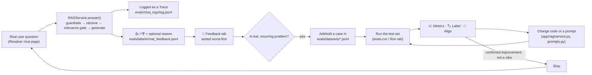

# The Self-Improvement Loop

This document exists for one purpose: to make the case, with real evidence rather
than a claim, that this project isn't just a RAG pipeline that was built once and
left alone. Every non-trivial change in its history followed the same discipline —
**measure, build, measure again** — and that discipline is itself a feature, not
just a process note. This is the write-up to point at in a capstone presentation
or an interview when the question is "how do you know it actually got better?"

Nothing here is aspirational. Every number below comes from a real eval run file
still sitting in `evals/results/` (gitignored, but present on disk — see the file
names cited inline), or from a code comment written at the time the finding was
made. Where I wasn't confident I could verify an exact old figure, I said so and
used the number I could actually verify instead of reciting one from memory.

---

## Table of Contents

- [The Four-Component Model, Applied Here](#the-four-component-model-applied-here)
- [The Loop](#the-loop)
- [Case Study 1: The Relevance Gate](#case-study-1-the-relevance-gate)
- [Case Study 2: Query Rewriting](#case-study-2-query-rewriting)
- [Case Study 3: Guardrails + Feedback](#case-study-3-guardrails--feedback)
- [What's Still Human-in-the-Loop](#whats-still-human-in-the-loop)
- [How to Narrate This](#how-to-narrate-this)

---

## The Four-Component Model, Applied Here

A recent class session framed a production agentic system as four components.
Mapped onto this actual codebase, not a hypothetical one:

| Component | This project |
|---|---|
| **Knowledge base** | ChromaDB + the ingested Mesos tickets/docs (`app/ingestion/`, `app/vectorstore/`) |
| **Reasoning pipeline** | `app/rag/service.py` (guardrails → retrieval → relevance gate → generation) and `app/rag/prompts.py` (the "skill" definitions — every prompt the pipeline runs on) |
| **Evaluation framework** | `evals/` — deterministic checks, LLM judges, human labels, judge-vs-human alignment (see [EVALS_GUIDE.md](EVALS_GUIDE.md)) |
| **Self-improvement loop** | Everything on this page: the measure→build→measure cycles below, plus `evals/chat_log.py` and the 💬 Feedback tab, which is the mechanism that feeds the *next* cycle |

The first three components are necessary but not sufficient — a knowledge base, a
reasoning pipeline, and an eval framework that nobody acts on is just expensive
documentation. The fourth component is what turns "we measured it once" into
"the system gets better over time." The rest of this document is evidence that the
fourth component is real here, not aspirational.

---

## The Loop

Three things about this loop are deliberate:

1. **The curated test set and live production feedback are two different inputs into the same loop, on purpose.** `evals/datasets/*.jsonl` is what SME judgment says the system should get right; `evals/chat_logs/` + `evals/labels/chat_feedback.jsonl` is what real usage says people actually asked and whether they were happy. Neither replaces the other — see [Case Study 3](#case-study-3-guardrails--feedback) for why they're kept in separate files rather than merged.
2. **Nothing ships on a claim.** Every case study below has a "before" number and an "after" number from the same test set, or an explicit note that the apparent change was noise, not signal.
3. **Building the instrumentation to measure one thing kept surfacing bugs in something else.** This happened three separate times (below) — building the thing that lets you *see* the problem, rather than guessing at a fix, is the actual pattern underneath all of this, more than any specific fix.

---

## Case Study 1: The Relevance Gate

**The problem, measured, not assumed.** An early full eval run
(`evals/results/20260921-212007-gpt-4o-mini.jsonl`, 30 queries) showed
`abstention_correct` at only **33%** (2/6) on `unanswerable` (off-topic) queries.
Concretely: asked an off-topic question (Jenkins, Elasticsearch, Nginx, ...), the
chatbot didn't say "I don't have relevant information" — it produced a confident,
fully-formatted "Suggested Resolution" built from generic knowledge about the
*wrong* technology, with an unrelated Mesos ticket cited as "supporting evidence"
to make it look grounded. That's a worse failure mode than just being wrong: it's
wrong *and* looks trustworthy.

**The fix that didn't work, tried and measured first.** A raw similarity-score
threshold before calling the LLM at all was the obvious first idea — cheap,
deterministic, no reliance on an LLM following an instruction. It failed on real
data: a query built from a **nonexistent ticket ID** scored a higher similarity
than 17 of 36 real, answerable questions, purely from sharing ticket-ID-shaped
vocabulary with the corpus. Similarity alone can't tell "same vocabulary" apart
from "same problem" — this needs judgment, not a cutoff.

**The fix that worked**: `RAGService._evidence_is_relevant()` — a second, cheap,
JSON-mode LLM call that runs after retrieval but before generation, and decides
whether the retrieved evidence is genuinely useful for *this* problem, not just
superficially similar. It fails **open** (treats an error or unparseable response
as "relevant, let generation decide") — a flaky gate call degrading to the
original behavior, rather than silently refusing a possibly-good question.

**Two real bugs, caught by building this, not by hunting for bugs:**

1. `is_abstention()` (the function that decides whether an answer counts as a
   decline) had a false positive: a full, correctly-cited answer that ended with a
   scope-narrowing hedge — "...not enough supporting evidence to recommend a
   *specific* fix beyond this" — was wrongly counted as a decline. This was
   distorting *both* the before and after measurement of this exact fix, not just
   one side of it. Fixed by requiring the abstain phrase to appear *before* any
   "Supporting Evidence" heading — a real decline never gets that far.
2. The gate's canned decline message reused `NO_EVIDENCE_ANSWER`'s wording ("no
   tickets were found") even when the gate had rejected evidence that genuinely
   *was* retrieved — a factually wrong claim. This was caught by the faithfulness
   eval judge itself, correctly flagging "the answer claims no tickets were found,
   but tickets are retrieved" as unsupported. Fixed with a distinct
   `IRRELEVANT_EVIDENCE_ANSWER` (`app/rag/service.py`).

**Measured result.** `unanswerable` `abstention_correct` went from 33% to **100%**,
and has stayed at 100% on every full run since
(`20260924-153323`, `20260925-100829`, `20260926-092726-team_test_cases` —
all in `evals/results/`).

---

## Case Study 2: Query Rewriting

**The problem, measured.** `retrieval_hit` (did the source ticket make it into the
top-k) was consistently weaker for questions phrased the way a ticket's
*description* or *resolution* text reads, versus questions phrased like a ticket's
*summary* — a user's own wording rarely matches a ticket's title.

**Built, measured, found a regression, root-caused it, cut scope:**

- First version: the original question **plus 3 LLM-generated rewrites**, all
  retrieved and merged. Measured: a small net gain on `retrieval_hit` /
  `context_relevance`, but retrieval latency roughly tripled, and `citations_valid`
  regressed (`evals/results/20260924-153323-gpt-4o-mini.jsonl`: 38/39, **97%**, one
  invented citation — every other run in this project's history is 100%).
- Root cause: merging results from more, more heterogeneous queries made it harder
  for the answering LLM to track which piece of evidence backed which claim in its
  own answer.
- Cut to the original question **plus exactly one** rewrite
  (`_generate_search_queries`, `app/rag/service.py`) — a narrower, cheaper bet on
  the same underlying fix. Measured again: `citations_valid` recovered to **100%**
  and has stayed there since (`20260925-100829` onward).
- A residual small dip in `faithfulness` after the cut looked like it might be a
  new problem — investigated directly rather than assumed away, by comparing
  retrieved evidence across runs. Two of the regressed cases had **byte-identical**
  retrieved evidence to the pre-change baseline but different judge verdicts across
  separate runs — direct proof that `gpt-4o-mini` at `temperature=0` is not
  perfectly deterministic run-to-run, and that some of that "regression" was
  measurement noise, not a real one. (`faithfulness` has since moved between 89%
  and 97% across four otherwise-identical runs on the same 39-query set — that
  band is the noise floor, not signal; see
  [EVALS_GUIDE.md § Known Findings](EVALS_GUIDE.md#known-findings-current-state).)

This is the same discipline as Case Study 1, applied to a *retrieval* problem
instead of a *behavior* problem — and applied to catching its own regression, not
just the original target metric.

---

## Case Study 3: Guardrails + Feedback

The most recent work, and the one that closes the loop back onto itself: it
included building the very mechanism (chat feedback) that will feed the next
iteration of this same cycle, and it received the same measure-before-trusting
treatment as everything above, including a bug the *feedback feature itself* had.

**Deliberately scoped, not copy-pasted from a lecture.** Asked to add guardrails,
the natural reflex is to implement a textbook 5-category taxonomy in full. Instead:
prompt-injection detection and PII redaction were built (clearly justified for
this project), while a "comms policy" guardrail (no natural fit for a technical
support tool) and a separate "high-risk escalation" guardrail (this app has no
write access to escalate anything — the existing relevance gate/abstention
behavior already covers it) were explicitly **not** built, with the reasoning
recorded in the commit message rather than silently skipped.

**Verified against real data, not just unit tests.** The PII regexes were run
directly against the real ingested ticket corpus before calling this done — not
just tested against synthetic examples. That check found genuine PII already
sitting in the historical data (real committer emails, a phone number in a comment
signature), confirming the regexes catch real cases, *and* surfaced an honest,
documented gap: the guardrail redacts the incoming question, not PII already
embedded in tickets that get cited as evidence. That's recorded as a known,
unsolved limitation in `app/rag/guardrails.py`'s own docstring — not
overclaimed as "PII-safe."

**A bug caught by re-reading the code, not by a user report.** While wiring chat
logging into the new `evals/chat_log.py`, a re-check of the redaction path found
that `RAGService.answer()`/`stream_answer()` redact a *local* copy of the question
— a reassignment that never propagates back to the caller's own variable. The chat
UI was about to log the **raw, unredacted** question to disk, defeating the point
of the guardrail for the one place PII actually hits persistent storage. Fixed by
redacting again at the actual persistence boundary (`log_chat_turn`,
`evals/chat_log.py`), with a regression test proving it.

**And then the feedback feature caught bugs in itself, live, from real usage —
twice:**

1. First report: after typing a reason and pressing Enter, nothing on screen
   changed, so it looked broken. Fixed with a confirmation caption.
2. Second report, immediately after: clicking 👎 *alone* looked like it
   auto-submitted feedback with nothing typed. Root cause: a bare `st.text_input`
   reruns the script — and, with fix #1, saved + confirmed — on its own first,
   untouched render, indistinguishable from a real submission. Fixed properly by
   moving the reason box into an `st.form`, so nothing commits until an explicit
   Submit. Writing the regression test for this surfaced a *third*, not yet
   reported, latent bug in the same code: the old version unconditionally
   re-saved an empty reason on every unrelated rerun, which would have silently
   overwritten an already-submitted reason back to blank the next time the user
   touched anything else on the page.

That third bug was never reported by a user — it was caught by insisting on a
test that proves the fix, not just a manual click-through. That's the same
discipline as Case Studies 1 and 2, just compressed into a single afternoon
instead of a full eval cycle.

---

## What's Still Human-in-the-Loop

Naming what *isn't* automated yet is itself part of the argument — it shows a
judgment call about where automation is earned versus where it would be
premature, the same "resist reflexively agent-ifying everything" principle that
[AGENTIC_PHASE2_GUIDE.md](AGENTIC_PHASE2_GUIDE.md) argues for elsewhere in this
project.

- **Triaging chat feedback into eval-set cases is manual.** A person reads the
  💬 Feedback tab and decides whether a thumbs-down represents a real, recurring
  problem worth a new row in `evals/datasets/*.jsonl`. There's no automatic
  "3 similar complaints → auto-add a test case."
- **No scheduled or CI-triggered re-evaluation.** Evals run on demand (CLI or the
  Run tab), not automatically on every prompt or code change. For a project this
  size, that's a reasonable trade — the value of a nightly run is low until there's
  enough traffic and enough contributors for regressions to slip past a human
  running it manually before a change ships.
- **No automatic judge-prompt tuning.** The Align tab surfaces exactly where a
  judge disagrees with a human label; a person still reads the disagreement and
  edits the prompt. An LLM proposing its own prompt edit from the disagreement
  data is a plausible next step, not something built here.
- **No clustering of similar feedback.** Each thumbs-down reason is read
  individually today. Simple keyword/embedding clustering on the reason text — to
  surface "5 people this week said the same thing" automatically — is a natural,
  well-scoped next addition, named here rather than built speculatively before
  there's enough real feedback volume to make it worth doing.

---

## How to Narrate This

Language for a presentation or an interview, not a summary of the document above:

- "I didn't just build a RAG pipeline once — I built the loop that keeps it
  honest. Every improvement I claim has a real before/after number from the same
  test set behind it, not a vibe."
- "The same pattern held three separate times: building the instrumentation to
  measure one thing kept surfacing real bugs in something else — a false-positive
  abstention detector, a factually wrong refusal message, a redaction that wasn't
  actually reaching disk. I found those by building things that let me *see* the
  problem, not by guessing at fixes."
- "When a fix didn't work — 3 query rewrites instead of 1 — I didn't rationalize
  it. I measured a regression, root-caused it, and cut scope. And when the *next*
  measurement still looked slightly off, I checked whether that was a real
  regression or just judge noise, before changing anything else."
- "The chat feedback feature isn't just a nice-to-have thumbs-up button — it's the
  production half of the same loop the SME eval set already proved out. It's how
  the next iteration of this cycle gets its input."
- "I can tell you exactly what's not automated yet, and why that's the right call
  at this size and stage — not an oversight I'm hoping nobody asks about."
