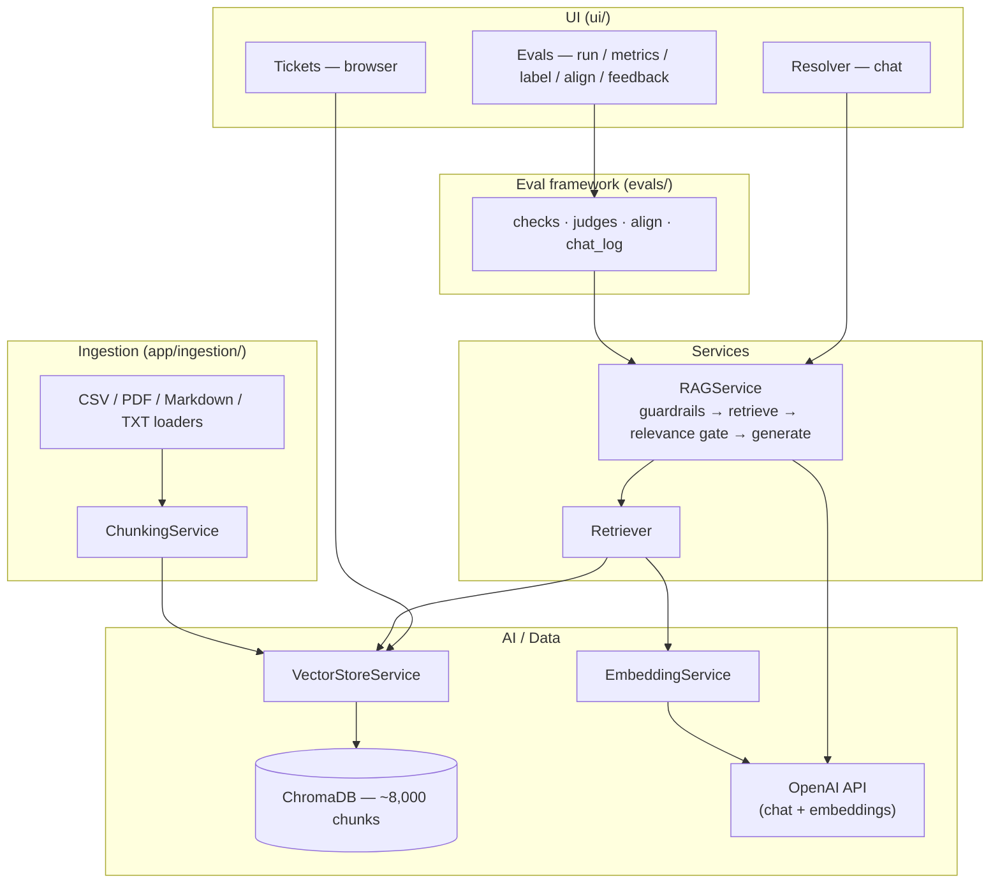
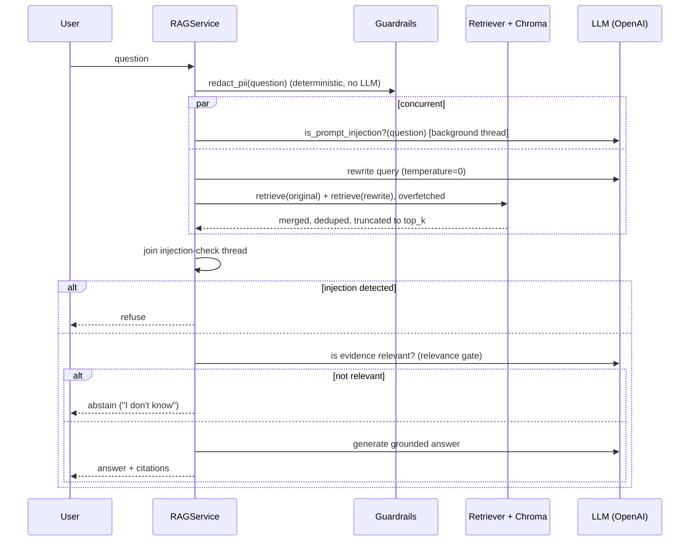

# System Design — AI Support Ticket Resolver

**Purpose of this document.** A design-review reference for the capstone panel: the problem framing, the system architecture, the key design decisions (and the alternatives rejected, and why), the data and evaluation design, and non-functional characteristics (performance, reliability, security). It intentionally does not re-explain how to click through the demo — see [`docs/INSTRUCTOR_GUIDE.md`](INSTRUCTOR_GUIDE.md) for that — or restate the full API/file-level reference already in [`README.md`](../README.md).

- **Live deployment:** https://ai-support-ticket-resolver-98jrlkvnj7jjfqumtdzuus.streamlit.app
- **Source:** this repository

---

## 1. Problem statement

Support engineers repeatedly re-investigate problems that were already solved in a past Jira ticket. The fix exists in the historical record, but two things stand between the engineer and it:

1. **Vocabulary mismatch.** A new ticket rarely uses the same words as the old one ("registry puller can't fetch manifests" vs. "405 Unsupported from ECR"), so keyword/full-text search misses the match.
2. **Trust.** Even when something surfaces, an engineer under time pressure needs to know *why* it's relevant and be able to verify it against the original ticket — not just receive a confident-sounding paragraph.

A second problem, treated as equally real rather than as an afterthought: **a system that quietly fabricates an answer, or answers confidently with no real supporting evidence, is worse than doing nothing** in a support context, because it costs an engineer trust and time debugging a wrong lead. A meaningful share of this system's design (§4.4, §5) exists specifically to prevent that failure mode, not just to produce plausible-looking answers.

## 2. Goals and non-goals

**Goals**
- Given a new support question, retrieve the historically similar ticket(s) regardless of exact wording, and produce a resolution grounded in that evidence with explicit citations back to source tickets.
- Refuse to answer, rather than guess, when there's no genuinely relevant evidence.
- Make every quality claim about the system checkable — via an eval framework a reviewer can run themselves, not just narrative claims.
- Treat the input surface (user-typed questions) as untrusted: defend against prompt injection and avoid leaking PII into logs/LLM calls.

**Non-goals (this phase)** — see [§7](#7-explicitly-out-of-scope-this-phase) for the full list and reasoning: a persisted ticket database/CRUD API, multi-step agentic tool use, cross-service production tracing, and corpus-wide PII scrubbing of the historical tickets themselves.

## 3. High-level architecture



**Boundary discipline:** each UI page talks to exactly one service (`RAGService` for chat, `VectorStoreService` for the ticket browser, `evals/` for the Evals page) — never directly to Chroma or OpenAI. This is what lets the deployment target change (e.g. Streamlit → a FastAPI-backed frontend in a later phase, §7) without touching retrieval/RAG logic.

### 3.1 Request path (a single question)



The injection check and the retrieval round run concurrently (`ThreadPoolExecutor`, joined right before generation) — it's on the critical path for safety but not for latency, so it shouldn't cost wall-clock time on the common case.

## 4. Component design

### 4.1 Ingestion

```
CSV / PDF / Markdown / TXT → Document Loaders → Normalization → Chunking → Embeddings → ChromaDB
```

- `BaseDocumentLoader` subclasses per source type (`TicketCSVLoader`, `PDFDocumentLoader`, `MarkdownDocumentLoader`, `TextDocumentLoader`); every loader returns a common `Document(page_content, metadata)`, so everything downstream (chunking, embedding, storage) is source-agnostic.
- **Embedded content vs. metadata is a deliberate, enforced split**: `summary`/`description`/`comments`/`resolution` go into the embedded text (semantic search surface); `ticket_id`/`component`/`status`/`issue_type`/dates go into Chroma metadata only (filtering, citations, display — never embedded, so they can't skew semantic similarity).
- `chunk_size=1200` / `chunk_overlap=150` (configurable via `.env`) — a reasonable starting default, not a tuned/evaluated hyperparameter (documented as such in `README.md` § Assumptions, not overclaimed).
- **Idempotent by design**: chunk IDs are derived deterministically from `ticket_id` + `chunk_index`, and writes use Chroma's `upsert` — re-running ingestion on the same source updates vectors in place instead of duplicating them.
- A configurable `CSVFieldMapping` (JSON override file or inline) lets a differently-shaped source CSV (e.g. the real, scoped Mesos dataset, whose columns don't match the default names) be ingested without touching ingestion code.

### 4.2 Retrieval

- **Multi-query retrieval**: the original question *and* one LLM-generated paraphrase are both embedded and searched; results are merged by best score across the two. This closes the vocabulary-mismatch gap from §1 (a paraphrase can surface a match the literal wording misses).
- **Overfetch-then-truncate**: Chroma is asked for `max(top_k * 6, 30)` candidates (constants `RETRIEVAL_OVERFETCH_MULTIPLIER=6`, `RETRIEVAL_OVERFETCH_MIN=30` in `app/rag/service.py`), merged, then truncated to the caller's requested `top_k` (default 5). This exists because of a measured, real recall failure in Chroma's HNSW index at small `n_results` — see the design decision in §5.1.
- Retrieval is a `Retriever` service wrapping `VectorStoreService`, which is the only module that ever calls Chroma directly.

### 4.3 Generation

- `RAGService.answer()` / `.stream_answer()`: guardrails → retrieve → relevance gate → generate, in that order, with the answer's prompt constructed (via LangChain) to cite only from the retrieved evidence — the model is instructed not to answer from parametric/background knowledge.
- Two distinct model roles, deliberately decoupled (`GATE_MODEL` vs. the user-selected chat model, §4.4): the "gate" model handles the three cheap internal LLM calls (rewrite, injection check, relevance check); the chat model handles the final answer generation the user actually reads. Picking a stronger/slower chat model in the UI no longer silently slows down or costs more on every internal gate call too — a real bug this decoupling fixed.

### 4.4 Guardrails

Two input guardrails run before every retrieval (`app/rag/guardrails.py`, `RAGService._is_prompt_injection`):

| Guardrail | Mechanism | Notes |
|---|---|---|
| Prompt-injection detection | Separate, cheap LLM classifier (JSON-mode, binary) | Runs concurrently with retrieval (§3.1); fails open on error, same as every other gate in the pipeline |
| PII redaction | Deterministic regex (email / phone / credit-card shapes) | Applied before the question is embedded, sent to any LLM, or logged. Deliberately does **not** redact IP addresses — real Mesos tickets legitimately contain them as operational data |

Deliberately scoped, not a full copy of a textbook guardrail taxonomy — see `docs/SELF_IMPROVEMENT_LOOP.md` § Case Study 3 for what was left out and a documented, honest gap: the historical corpus itself can still contain real PII that a cited chunk surfaces; input redaction doesn't retroactively clean the corpus (also listed in §8 here).

### 4.5 Evaluation framework

Kept in-house rather than adopting a hosted eval platform (e.g. LangSmith) — full, editable access to every trace and judge prompt as plain JSONL/Markdown, no export/import round-trip, no recurring cost, and every number in `docs/INSTRUCTOR_GUIDE.md` is independently reproducible by anyone with the repo and an API key. Full design: `docs/EVALS_GUIDE.md`.

- **Deterministic checks** (code, not LLM): `retrieval_hit`, `citations_valid` (no invented ticket IDs), `abstention_correct`, `has_required_sections`, `within_latency`.
- **LLM-as-judge** (binary 0/1 + one-line reason, editable Markdown prompts): `context_relevance`, `faithfulness`, `answer_relevancy`.
- **Human labeling & judge-human alignment**: a human labels a trace pass/fail blind to the judge's verdict; a confusion matrix (TP/TN/FP/FN) shows where the judge and the human disagree, and a judge prompt can be edited and re-run against the *same* stored traces to check whether alignment improved — so an LLM judge is verified against ground truth, never trusted uncritically.
- **Production feedback loop**: every live chat turn is logged; every 👍/👎 is captured as a human label (kept separate from curated SME ground truth) and surfaces in a **Feedback** tab, sorted worst-first — the mechanism by which a real recurring complaint becomes a new eval-set case.

## 5. Key design decisions (and rejected alternatives)

Full numbers for every item below: `docs/INSTRUCTOR_GUIDE.md` § 5, or `docs/SELF_IMPROVEMENT_LOOP.md` for the full narrative.

### 5.1 Recall fix: overfetch, not a smaller index or a reranker

**Observed problem:** the same question, asked twice, sometimes produced different answers. Root-caused (bypassing all app code, calling Chroma's raw API directly) to Chroma's HNSW index missing a true nearest neighbor at `n_results=5` that `n_results=50` found at rank 1 — an inherent property of approximate search at small `n_results` on an 8,000+ chunk corpus, not a bug in this codebase.

**Alternatives considered:**
- *A reranking stage* — rejected. Reranking fixes a **ranking** failure (right ticket present but ordered low); the diagnosed failure was a **recall** failure (right ticket entirely absent from the candidate set). A reranker cannot rerank a ticket that was never retrieved. This is stated plainly as a scope choice, not an oversight — worth revisiting if a future eval run shows a ranking-shaped failure instead of a recall-shaped one.
- *Overfetch-then-truncate* — chosen. Directly matches the diagnosed failure, measured negligible latency cost (single-digit ms regardless of `n_results`), and moved `retrieval_hit` from 72%→78% on the SME test set with a `faithfulness` improvement alongside it.

### 5.2 Query rewriting: exactly one rewrite, not three

Three LLM-generated rewrites (searched and merged alongside the original) was tried first, on the theory that more query diversity could only help recall. Measured effect: it *reduced* `citations_valid` (97%→100% when cut back to one) — merging evidence from more candidate queries increased the chance the generator cited a ticket that wasn't actually the best match. One rewrite was kept as the point that improved recall without introducing that regression.

### 5.3 Rewrite temperature: 0, not 0.3

A user-reported bug (same question → two different answers on separate asks) was traced to the query-rewrite LLM call running at `temperature=0.3` — the rewritten query text itself varied call to call, changing what got retrieved. Fixed to `temperature=0`; rewrite-text stability improved from "different every call" to 4/5 identical across repeated calls. Explicitly documented as a *reduction*, not full elimination, of non-determinism — `gpt-4o-mini` is not bit-perfect at `temperature=0` at the OpenAI API level, which is outside this project's control.

### 5.4 The relevance gate: abstain rather than answer from bad evidence

Before a relevance gate existed, the system had no way to say "I don't know" — every question got an answer, including off-topic ones, generated from whatever evidence retrieval happened to return. Adding an explicit "is this evidence actually on-topic?" LLM check before generation moved `abstention_correct` on unanswerable questions from 33% to 83–100% across subsequent runs — the single largest quality change in this project's history, and directly addresses the §1 "confidently wrong is worse than silent" problem.

### 5.5 Latency: concurrency and batching, not a smaller/cheaper model

Two independent latency wins were shipped without changing model choice or answer quality: (1) the prompt-injection check moved off the sequential critical path into a background thread that runs alongside retrieval instead of before it; (2) the original-question and rewritten-query retrievals were batched into a single round instead of two sequential ones. Net effect measured on the SME test set: total p50 latency 4.2s → 3.7s (−12%), retrieval p50 2.31s → 1.56s (−32%), with quality metrics unchanged (verified, not assumed).

## 6. Data design

- **Vector store:** ChromaDB, persistent local collection, cosine similarity (`hnsw:space=cosine`), ~8,000 chunks from the real, scoped Apache Mesos Jira ticket corpus (`data/mesos_scoped.csv`).
- **Chunk document:** ticket title + problem description + resolution text (the semantic search surface).
- **Chunk metadata:** `ticket_id`, `component`, `status`, `issue_type`, `created_date`, `resolved_date`, `source_type`, `source_file`, `chunk_index` — used for filtering, citations, and the Tickets-page display; never embedded.
- **Eval datasets** (`evals/datasets/`, committed to git, hand-curated): `queries.jsonl` (31 cases: answerable / unanswerable / filtered) and `team_test_cases.jsonl` (39 SME-authored cases).
- **Labels** (`evals/labels/`): `human_labels.jsonl` (curated SME ground truth for judge alignment, committed) kept strictly separate from `chat_feedback.jsonl` (real users' 👍/👎 on live answers, gitignored) — the two serve different purposes and mixing them would contaminate the alignment signal with unvetted production noise.
- **Traces** (`evals/results/`, gitignored) and **chat logs** (`evals/chat_logs/`, gitignored): one JSONL per eval run / per live conversation turn respectively.

## 7. Explicitly out of scope (this phase)

Deliberately deferred, with the service boundaries in §3 designed so each can be added later without rewriting retrieval/RAG logic — `RAGService.answer(question, filters)` is the intended seam, callable from Streamlit today, a FastAPI route tomorrow, or wrapped as a LangGraph tool/node later:

- FastAPI application layer + a persisted ticket database (PostgreSQL) with CRUD endpoints
- LangGraph orchestration / multi-step agentic tool use, MCP integrations
- Duplicate-ticket detection, conflict/outdated-resolution detection
- Production-grade distributed tracing (today's chat logging is a local, gitignored JSONL file with no span IDs or cross-service correlation, and doesn't survive a redeploy on an ephemeral host)
- Corpus-wide PII redaction (the guardrail only redacts the incoming question, not the historical tickets already in the corpus — see §8)

Full roadmap: `docs/AGENTIC_PHASE2_GUIDE.md`.

## 8. Non-functional characteristics

**Performance.** Current p50 end-to-end latency ≈ 3.7–3.8s, p95 ≈ 4.7–4.9s (both eval datasets, `gpt-4o-mini`); retrieval itself is p50 ≈ 1.6s regardless of overfetch (§5.1) since Chroma's per-query cost is dominated by fixed overhead, not `n_results`. See `docs/INSTRUCTOR_GUIDE.md` § 6 for the full current breakdown.

**Reliability / failure mode.** Every LLM-backed gate (injection check, relevance gate) **fails open** — a gate error doesn't block the user, it degrades to "gate didn't run" rather than "system unavailable." This is a deliberate availability-over-strictness choice for a support tool; a stricter regulated-domain version of this system would likely fail closed instead.

**Security / privacy.**
- Prompt-injection defense on every question (§4.4), independent of and prior to any retrieval or generation.
- Deterministic PII redaction on the *input* question before it's embedded, sent to an LLM, or logged.
- **Known, documented gap** (not silently absent): the historical ticket corpus itself was not scrubbed, so a cited chunk can still surface PII that was already present in a real historical ticket. Input redaction and corpus redaction are different problems; only the former is solved today.

**Idempotency.** Ingestion is safe to re-run against the same source (§4.1) — no duplicate vectors, no manual cleanup step required between runs.

**Testability.** 230+ automated tests (`pytest` + Streamlit's `AppTest` for headless UI testing), covering ingestion, chunking, retrieval, the full RAG service including guardrails/relevance-gate/query-rewriting, and the eval framework itself.

## 9. Deployment

Deployed on Streamlit Community Cloud: https://ai-support-ticket-resolver-98jrlkvnj7jjfqumtdzuus.streamlit.app — the corpus auto-ingests on first run if the vector store is empty (`app/ingestion/bootstrap.py`), so the deployment needs no separate provisioning step beyond an `OPENAI_API_KEY`. Locally, the same entrypoint (`streamlit run ui/resolver_support.py`) runs against a local, persistent Chroma instance.

## 10. Further reading

| Doc | What it covers |
|---|---|
| [`README.md`](../README.md) | Full setup, project structure, file-level reference |
| [`docs/INSTRUCTOR_GUIDE.md`](INSTRUCTOR_GUIDE.md) (also as PDF) | Grading/demo walkthrough, feature checklist, before/after metrics |
| [`docs/EVALS_GUIDE.md`](EVALS_GUIDE.md) | Full eval framework walkthrough, worked examples, FAQ |
| [`docs/SELF_IMPROVEMENT_LOOP.md`](SELF_IMPROVEMENT_LOOP.md) | The measure→build→measure case studies, in full narrative form with real before/after numbers |
| [`docs/AGENTIC_PHASE2_GUIDE.md`](AGENTIC_PHASE2_GUIDE.md) | The Phase 2 roadmap referenced in §7 |
